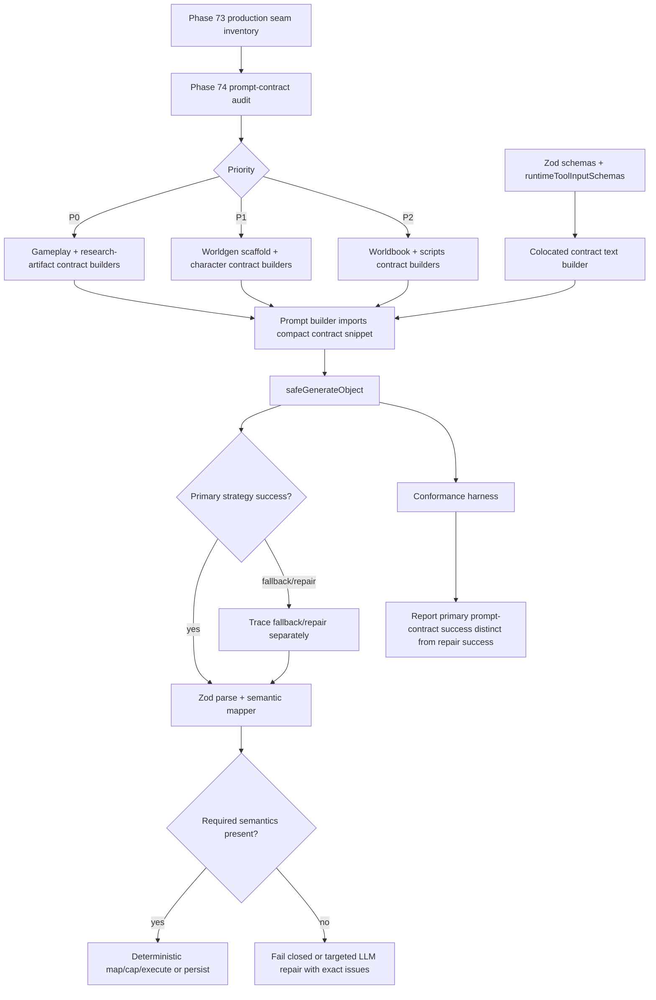

# Phase 74: Structured Prompt Contracts and Model-Facing Schema Hardening - Research

**Researched:** 2026-04-28 [VERIFIED: gsd init phase-op 74]
**Domain:** Backend AI structured-output prompt contracts, Zod schema boundaries, provider conformance [VERIFIED: 74-CONTEXT.md; backend/src/ai/generate-object-safe.ts]
**Confidence:** HIGH for repo inventory and implementation seams; MEDIUM for future live-provider behavior because provider output quality must be rechecked with live conformance [VERIFIED: 74-STRUCTURED-PROMPT-AUDIT.md; backend/src/ai/structured-output-conformance.ts]

<user_constraints>
## User Constraints (from CONTEXT.md)

The following locked decisions and deferred ideas are copied verbatim from `.planning/phases/74-structured-prompt-contracts-and-model-facing-schema-hardenin/74-CONTEXT.md`. [VERIFIED: 74-CONTEXT.md]

### Locked Decisions

#### Scope

- Treat structured-output stability as a class problem, not as the last stack frame that happened to fail.
- Use the Phase 73 inventory as input, but refresh it into a prompt-contract audit. Phase 73 classified boundaries; Phase 74 evaluates whether each boundary gives the model a clear contract before generation.
- Cover all production `safeGenerateObject` callers, including files that alias it as `generateObject`.
- Include direct structured/prose boundary checks for `generateText` paths only when they ask for JSON or tool-like data.

#### Model-Facing Contract Standard

- Every non-trivial structured-output prompt must include explicit instructions for required fields, nested arrays/objects, allowed enum values, allowed tool names, string caps, max list sizes, optional/null behavior, and a compact valid example.
- A prompt that says only "return JSON", "return structured data", or "use the schema fields" is insufficient for high-risk paths.
- The model should not be expected to invent hidden backend fields, UUIDs, action IDs, event IDs, or mechanical refs when backend can derive them deterministically.
- If a tool/action has nested input shape, the model-facing prompt must show that nested shape. It is not enough to list the top-level `toolName`.

#### Backend Authority

- Backend remains final deterministic authority for validation, caps, execution, rollback, and persistence.
- Backend may deterministically trim strings, cap arrays, map known aliases, generate backend IDs, resolve actor refs from explicit allowed labels/IDs, and drop optional non-executable UI outputs when no recoverable shape exists.
- Backend must not invent semantic lore, source roles, targets, actor intent, power facts, tool actions, quick action labels, or canonical truth to make a schema pass.
- If required semantics are missing, the correct fixes are: better initial prompt, targeted LLM repair with exact issues and target contract, or fail closed with a logged root cause.

#### Verification Expectations

- Tests must assert prompt-contract presence and content, not only that Zod repair can recover broken output.
- Representative regression fixtures must cover the observed failure classes: `citations` string vs array, `canonicalNames` string vs object, overlong metadata, missing nested `input.actions[].action`, `payload` vs `input`, missing/unsupported `toolName`, malformed optional quick actions, and underspecified power stats.
- Conformance must distinguish primary success from fallback/repair success. A provider that only passes after repair is not "stable" for the prompt-contract case.

#### Non-Goals

- Do not remove Zod. Zod remains the final boundary.
- Do not make backend semantically interpret user premises or canon meaning.
- Do not rewrite the entire worldgen/gameplay architecture.
- Do not claim live writing quality is solved by structured-output contract hardening.

### Claude's Discretion

No explicit `## Claude's Discretion` section exists in `74-CONTEXT.md`. [VERIFIED: 74-CONTEXT.md]

### Deferred Ideas (OUT OF SCOPE)

- Model ranking/selection based on literary quality is not part of this phase.
- Full live gameplay playtest is still a separate milestone-quality gate.
- Provider-specific response-format negotiation was handled in Phase 73; Phase 74 may add conformance cases but should not redesign provider registry unless the audit proves a gap.
</user_constraints>

<phase_requirements>
## Phase Requirements

| ID | Description | Research Support |
|----|-------------|------------------|
| P74-R1 | The Phase 73 structured-output inventory is refreshed into a prompt-contract audit that records each production structured/model-output seam, prompt builder, schema/tool contract, known failure class, and owner. [VERIFIED: .planning/REQUIREMENTS.md] | Use the P0/P1/P2 seam table, static grep strategy, and audit record fields in this research. [VERIFIED: 74-STRUCTURED-PROMPT-AUDIT.md; rg production callsite scan] |
| P74-R2 | Every structured-output prompt that asks for JSON/tool-shaped data includes explicit model-facing contract text: required fields, nested shapes, allowed enum/tool names, string/list caps, nullable/optional rules, and at least one compact example when the shape is non-trivial. [VERIFIED: .planning/REQUIREMENTS.md] | Use the Prompt Contract Standard and builder patterns below. [VERIFIED: 74-CONTEXT.md] |
| P74-R3 | Shared prompt-contract helpers or colocated contract builders prevent schema drift between Zod/tool definitions and prompt instructions; automated tests fail when high-risk structured-output callers omit the required contract marker. [VERIFIED: .planning/REQUIREMENTS.md] | Use colocated contract helpers near schemas/tool definitions plus marker tests. [VERIFIED: backend/src/character/prompt-contract.ts; backend/src/engine/tool-schemas.ts] |
| P74-R4 | Regression coverage spans the observed classes across gameplay, worldgen, character, and worldbook seams: strings returned where arrays/objects are required, missing nested tool fields, overlong fields, invented tool names, payload/input aliasing, and malformed optional UI actions. [VERIFIED: .planning/REQUIREMENTS.md] | Use the regression fixture matrix and validation architecture below. [VERIFIED: 74-CONTEXT.md; backend/src/ai/__tests__/generate-object-safe.test.ts; backend/src/engine/__tests__/scene-planner.test.ts] |
| P74-R5 | Backend repair/sanitization policy remains deterministic: it may coerce shape, trim caps, map aliases, or drop optional non-executable outputs, but it must not invent semantic lore, actions, targets, power facts, source roles, or canonical truth to satisfy a schema. [VERIFIED: .planning/REQUIREMENTS.md] | Use the deterministic repair policy table below. [VERIFIED: 74-CONTEXT.md; 73-03-PLAN.md] |
| P74-R6 | Structured-output conformance distinguishes "primary prompt-contract success" from fallback/repair success and reports prompt-contract case failures for active role models before long-running worldgen/gameplay flows are called stable. [VERIFIED: .planning/REQUIREMENTS.md] | Extend `StructuredOutputConformanceResult` beyond current `repairUsed`/`success` fields with explicit primary-success reporting. [VERIFIED: backend/src/ai/structured-output-conformance.ts] |
</phase_requirements>

## Project Constraints (from CLAUDE.md)

- Backend is Hono + TypeScript strict; frontend is Next.js App Router + Tailwind + Shadcn; validation uses Zod for all schemas. [VERIFIED: CLAUDE.md]
- LLM is narrator only; the deterministic engine owns state mutation, validation, rollback, and persistence. [VERIFIED: CLAUDE.md]
- All AI agents use structured tool calling and backend validates every tool call before execution. [VERIFIED: CLAUDE.md]
- WorldForge uses four LLM roles: Judge, Storyteller, Generator, and Embedder; Judge is structured JSON and Storyteller is prose. [VERIFIED: CLAUDE.md]
- Prefer AI SDK functions over raw fetch for LLM calls. [VERIFIED: CLAUDE.md]
- Shared types/constants should come from `@worldforge/shared` instead of duplication. [VERIFIED: CLAUDE.md]
- Use GitNexus for unfamiliar code exploration and run impact analysis before editing symbols; Phase 74 planning may require that before implementation edits, but this research task edits no code symbols. [VERIFIED: CLAUDE.md; GitNexus status]

## Summary

Phase 74 should treat the root cause as a prompt-contract gap, not as a provider transport or Zod issue. Phase 73 made `safeGenerateObject` native-first and traceable, with text fallback and repair, but native structured output can still accept an underspecified prompt and produce a schema-shaped object that is semantically weak or only passes after repair. [VERIFIED: 73-02-PLAN.md; backend/src/ai/generate-object-safe.ts; backend/src/ai/structured-output-conformance.ts]

The maintainable implementation strategy is to colocate compact model-facing contract builders beside the schemas/tool definitions they describe, then import those snippets into prompt builders. The project already has a useful precedent in `backend/src/character/prompt-contract.ts`, while the highest-risk missing contract content is in nested tool-input surfaces such as ScenePlanner and hidden adjudication, plus worldgen generated context. [VERIFIED: backend/src/character/prompt-contract.ts; 74-STRUCTURED-PROMPT-AUDIT.md; backend/src/engine/scene-planner.ts; backend/src/worldgen/ip-researcher.ts]

**Primary recommendation:** implement Phase 74 in four waves: audit/contract IDs first, P0 gameplay and research-artifact contracts second, P1/P2 breadth third, and conformance/reporting hardening last. [VERIFIED: 74-CONTEXT.md; 74-STRUCTURED-PROMPT-AUDIT.md]

## Architectural Responsibility Map

| Capability | Primary Tier | Secondary Tier | Rationale |
|------------|--------------|----------------|-----------|
| Structured-output seam inventory | API / Backend | Tests | All production structured model calls are under `backend/src`, and Phase 73/74 audit files are backend-oriented. [VERIFIED: 73-STRUCTURED-OUTPUT-INVENTORY.md; rg production callsite scan] |
| Model-facing prompt contracts | API / Backend | Schema modules | Prompt builders, Zod schemas, and runtime tool schemas live in backend modules. [VERIFIED: backend/src/engine/scene-planner.ts; backend/src/engine/tool-schemas.ts; backend/src/worldgen/research-artifact.ts] |
| Runtime tool input contract exposure | API / Backend | Engine | `runtimeToolInputSchemas` is the backend source for executable tool input shapes, and scene/judge prompts consume tool names. [VERIFIED: backend/src/engine/tool-schemas.ts; backend/src/engine/scene-planner.ts] |
| Deterministic repair and sanitation | API / Backend | Database / Storage | Backend owns validation and persistence; repair must never invent missing semantics. [VERIFIED: CLAUDE.md; 74-CONTEXT.md] |
| Provider conformance reporting | API / Backend | External LLM providers | `structured-output-conformance.ts` runs provider/model/schema cases and reports strategy/repair/semantic status. [VERIFIED: backend/src/ai/structured-output-conformance.ts] |
| User-visible final narration | API / Backend | Browser / Client | Storyteller prose is not the main Phase 74 target unless it asks for JSON/tool-like data; frontend only displays results. [VERIFIED: 74-CONTEXT.md; backend/src/engine/turn-processor.ts] |

## Standard Stack

### Core

| Library / Module | Version | Purpose | Why Standard |
|------------------|---------|---------|--------------|
| `ai` | project range `^6.0.106`; npm current `6.0.168`, published 2026-04-16 [VERIFIED: backend/package.json; npm registry] | AI SDK `generateText`, `Output.object`, `Output.json`, and tool mode inside `safeGenerateObject`. [VERIFIED: backend/src/ai/generate-object-safe.ts] | Project policy prefers AI SDK functions over raw fetch. [VERIFIED: CLAUDE.md] |
| `zod` | project range `^4.3.6`; npm current `4.3.6`, published 2026-01-22 [VERIFIED: backend/package.json; npm registry] | Final schema validation for AI objects, tool inputs, API payloads, and conformance cases. [VERIFIED: CLAUDE.md; backend/src/engine/tool-schemas.ts] | Phase 74 explicitly keeps Zod as final boundary. [VERIFIED: 74-CONTEXT.md] |
| `safeGenerateObject` | internal module [VERIFIED: backend/src/ai/generate-object-safe.ts] | Shared generation boundary with primary strategy, fallback, repair trace, and schema validation. [VERIFIED: backend/src/ai/generate-object-safe.ts] | Phase 73 made it the production structured-output boundary; Phase 74 should not bypass it. [VERIFIED: 73-02-PLAN.md; 73-STRUCTURED-OUTPUT-INVENTORY.md] |
| `structured-output-conformance` | internal module [VERIFIED: backend/src/ai/structured-output-conformance.ts] | Non-mutating provider/model/schema conformance harness. [VERIFIED: backend/src/ai/structured-output-conformance.ts] | Phase 74 must distinguish primary prompt-contract success from fallback/repair success. [VERIFIED: 74-CONTEXT.md] |
| `vitest` | project range `^3.2.4`; npm current `4.1.5`, published 2026-04-21 [VERIFIED: backend/package.json; npm registry] | Unit/static contract tests. [VERIFIED: backend/vitest.config.ts] | Existing backend tests already use Vitest with `src/**/*.test.ts`. [VERIFIED: backend/vitest.config.ts] |

### Supporting

| Library / Module | Version | Purpose | When to Use |
|------------------|---------|---------|-------------|
| `typescript` | project range `^5.9.3` [VERIFIED: backend/package.json] | Typechecking contract helpers and schema imports. [VERIFIED: backend/package.json] | Run after contract helper edits and test additions. [VERIFIED: backend/package.json] |
| `GitNexus` | index current at commit `50c1f3d` [VERIFIED: git rev-parse HEAD; npx gitnexus status; GitNexus list_repos] | Impact/context analysis before implementation edits. [VERIFIED: CLAUDE.md; GitNexus list_repos] | Required before modifying functions/classes/methods during implementation, not needed for this research-only file. [VERIFIED: CLAUDE.md] |
| `rg` | `14.1.0` [VERIFIED: rg --version] | Static production seam discovery. [VERIFIED: rg production callsite scan] | Use for Phase 74 audit refresh and marker coverage checks. [VERIFIED: 74-STRUCTURED-PROMPT-AUDIT.md] |

### Alternatives Considered

| Instead of | Could Use | Tradeoff |
|------------|-----------|----------|
| Colocated compact contract builders | One giant global schema prompt | Global prompts become stale and bloated; Phase 74 needs per-seam nested shapes and examples. [VERIFIED: 74-CONTEXT.md; backend/src/character/prompt-contract.ts] |
| Zod as final validator | Custom validators/parsers | Non-goal explicitly keeps Zod; custom parsing would add drift. [VERIFIED: 74-CONTEXT.md] |
| `safeGenerateObject` | Direct AI SDK `generateObject` imports | Existing boundary tests block direct production AI SDK `generateObject` imports. [VERIFIED: 74-STRUCTURED-PROMPT-AUDIT.md; backend/src/ai/__tests__/structured-output-boundary.test.ts] |
| Primary-success conformance reporting | Treat repaired success as pass | Phase 74 says repair-only pass is not stable for prompt-contract cases. [VERIFIED: 74-CONTEXT.md] |

**Installation:** no new package is recommended for Phase 74. [VERIFIED: backend/package.json; 74-CONTEXT.md]

```bash
# No install step expected.
npm --prefix backend run typecheck
```

**Version verification:** `npm view ai version time --json`, `npm view zod version time --json`, and `npm view vitest version time --json` were run on 2026-04-28. [VERIFIED: npm registry]

## Architecture Patterns

### System Architecture Diagram



The planner should assign implementation tasks along this flow: inventory -> contract builders -> prompt integration -> deterministic validation -> conformance reporting. [VERIFIED: 74-CONTEXT.md; backend/src/ai/generate-object-safe.ts; backend/src/ai/structured-output-conformance.ts]

### Recommended Project Structure

```text
backend/src/
├── ai/
│   ├── generate-object-safe.ts
│   ├── structured-output-conformance.ts
│   └── __tests__/
├── engine/
│   ├── prompt-contracts.ts          # recommended colocated engine contract helpers [ASSUMED]
│   ├── scene-planner.ts
│   ├── hidden-adjudication.ts
│   ├── world-brain.ts
│   └── tool-schemas.ts
├── worldgen/
│   ├── prompt-contracts.ts          # recommended generatedContext/scaffold snippets [ASSUMED]
│   ├── ip-researcher.ts
│   ├── research-artifact.ts
│   └── scaffold-steps/
├── character/
│   ├── prompt-contract.ts           # existing precedent [VERIFIED: backend/src/character/prompt-contract.ts]
│   └── ingestion/
└── worldbook-library/
    └── composition.ts
```

`prompt-contracts.ts` filenames are a recommendation, not an existing repo fact. [ASSUMED]

### Pattern 1: Colocated Compact Contract Builders

**What:** Put contract text builders beside the schema/tool definitions they describe, then import the compact snippets into prompt builders. [VERIFIED: backend/src/character/prompt-contract.ts; backend/src/engine/tool-schemas.ts]

**When to use:** Use for any non-trivial structured object, nested object/array, tool input, enum, nullable/optional field, or capped output. [VERIFIED: 74-CONTEXT.md]

**Example:**

```ts
// Source pattern: backend/src/character/prompt-contract.ts and runtime tool schemas.
export function buildScenePlannerPromptContract(allowedTools: string[]): string {
  return [
    "STRUCTURED_OUTPUT_CONTRACT: scene-planner.v1",
    "Return one object with actionInterpretation, primaryResponse, supportResponses, plannedActions, deferredHooks, hiddenRationale.",
    "plannedActions[].toolName must be one of: " + allowedTools.join(", "),
    "plannedActions[].input must match the selected tool's input shape shown below.",
    "Example: { \"plannedActions\": [{ \"toolName\": \"offer_quick_actions\", \"input\": { \"actions\": [{ \"label\": \"Ask about the curse\", \"action\": \"Ask Gojo about the curse.\" }] } }] }",
  ].join("\n");
}
```

The example is illustrative and must be adjusted to actual exported tool names and schemas during implementation. [ASSUMED]

### Pattern 2: Schema/Tool Contract Is Readable by the Model

**What:** Native schema mode can constrain transport, but the prompt still needs natural-language schema instructions and a compact valid object example. [VERIFIED: 74-CONTEXT.md; backend/src/ai/generate-object-safe.ts]

**When to use:** Use on P0/P1 seams even when `Output.object({ schema })` is used. [VERIFIED: backend/src/ai/generate-object-safe.ts; 74-CONTEXT.md]

**Implementation rule:** do not dump raw Zod internals into prompts; hand-curate concise contract text from the schema and examples while deriving allowed tool names/enums from source constants where feasible. [VERIFIED: backend/src/engine/tool-schemas.ts; ASSUMED]

### Pattern 3: Prompt-Contract Marker Tests

**What:** Require high-risk prompt builders to include stable markers such as `STRUCTURED_OUTPUT_CONTRACT: scene-planner.v1`. [VERIFIED: P74-R3 in .planning/REQUIREMENTS.md]

**When to use:** Use for all P0 and P1 structured-output prompt builders; P2 can start as warning/list coverage unless planner decides to hard-gate all production seams. [VERIFIED: 74-STRUCTURED-PROMPT-AUDIT.md; ASSUMED]

**Example:**

```ts
// Source pattern: existing Vitest backend tests under backend/src/**/__tests__.
expect(prompt).toContain("STRUCTURED_OUTPUT_CONTRACT: generated-context.v1");
expect(prompt).toContain("citations");
expect(prompt).toContain("canonicalNames");
expect(prompt).toContain("Example:");
```

### Pattern 4: Conformance Primary Success

**What:** Record whether a prompt-contract case passed through the primary strategy without fallback/repair. [VERIFIED: 74-CONTEXT.md]

**Current gap:** `StructuredOutputConformanceResult` has `repairUsed`, `strategy`, `semanticPass`, and `success`, but it does not expose a separate `primaryPromptContractSuccess` field. [VERIFIED: backend/src/ai/structured-output-conformance.ts]

**Recommended result fields:** add `promptContractId`, `primaryPromptContractSuccess`, `fallbackUsed`, and `repairUsed` so repaired success is visible but not counted as stable primary success. [VERIFIED: 74-CONTEXT.md; ASSUMED]

### Anti-Patterns to Avoid

- **Giant duplicated schema prompt:** it will drift from Zod/tool definitions and make every prompt expensive to review. [VERIFIED: 74-CONTEXT.md; backend/src/character/prompt-contract.ts]
- **"Return structured data" as a contract:** Phase 74 explicitly marks this insufficient for high-risk paths. [VERIFIED: 74-CONTEXT.md]
- **Counting repair as stability:** Phase 74 requires primary success to be distinct from fallback/repair success. [VERIFIED: 74-CONTEXT.md]
- **Backend semantic invention:** backend may normalize shape but must not invent lore, action text, source roles, targets, power facts, or canonical truth. [VERIFIED: 74-CONTEXT.md]
- **Find-and-replace prompt patches:** implementation should use GitNexus impact/context before symbol edits and keep contract builders maintainable. [VERIFIED: CLAUDE.md]

## Prompt Contract Standard

Every non-trivial structured prompt must include these parts. [VERIFIED: 74-CONTEXT.md]

| Contract Part | Required Content | Example Phase 74 Application |
|---------------|------------------|------------------------------|
| Marker | Stable `STRUCTURED_OUTPUT_CONTRACT: <domain>.<version>` marker. [VERIFIED: P74-R3] | `generated-context.v1`, `scene-planner.v1`, `hidden-adjudication.v1`. [ASSUMED] |
| Required fields | Top-level required keys and nested required keys. [VERIFIED: 74-CONTEXT.md] | `generatedContext.keyFacts`, `citations[].note`, `plannedActions[].input`. [VERIFIED: backend/src/worldgen/research-artifact.ts; backend/src/engine/semantic-scene-plan-schema.ts] |
| Nested shapes | Arrays/objects with object examples, not only field names. [VERIFIED: 74-CONTEXT.md] | `citations: [{ jobId?, url?, note }]`; `canonicalNames: { locations?, factions?, characters? }`. [VERIFIED: 74-CONTEXT.md; backend/src/worldgen/research-artifact.ts] |
| Enums/tool names | Allowed enum values and allowed tool names from source constants. [VERIFIED: 74-CONTEXT.md] | ScenePlanner/hidden judge must show allowed `toolName` values and per-tool input shape. [VERIFIED: backend/src/engine/scene-planner.ts; backend/src/engine/tool-schemas.ts] |
| Caps | String caps, max list sizes, and count limits. [VERIFIED: 74-CONTEXT.md] | WorldBrain has bounded fields and list limits that should be visible in the prompt. [VERIFIED: backend/src/engine/world-brain.ts] |
| Optional/null behavior | Whether empty arrays, omitted fields, or explicit `null` are expected. [VERIFIED: 74-CONTEXT.md] | Target classifier should show `{ targetName: null, targetType: null }` when no concrete allowed target exists. [VERIFIED: backend/src/engine/target-context.ts] |
| Compact valid example | One realistic valid object for non-trivial shapes. [VERIFIED: 74-CONTEXT.md] | Use short examples, not full campaign dumps. [ASSUMED] |

## Priority Seams

### P0 Seams

| Seam | Prompt Builder / Caller | Schema / Contract Source | Why P0 | Required Phase 74 Work |
|------|-------------------------|--------------------------|--------|------------------------|
| ScenePlanner semantic plan | `buildDefaultScenePlannerPrompt`, `runScenePlanner` [VERIFIED: backend/src/engine/scene-planner.ts] | `semanticScenePlanSchema` and runtime tool names/inputs [VERIFIED: backend/src/engine/semantic-scene-plan-schema.ts; backend/src/engine/tool-schemas.ts] | Visible normal-turn critical path; wrong tool shape can break or mis-execute a player turn. [VERIFIED: 74-STRUCTURED-PROMPT-AUDIT.md; 73-03-PLAN.md] | Add nested `plannedActions[].input` contract per allowed tool, compact example, marker test, and regression fixtures for `payload` alias, missing nested fields, unsupported tool names, and malformed quick actions. [VERIFIED: 74-CONTEXT.md] |
| Hidden adjudication action plan | `buildJudgeAdjudicationContract` [VERIFIED: backend/src/engine/hidden-adjudication.ts] | `adjudicationActionSchema` and `runtimeToolInputSchemas` [VERIFIED: backend/src/engine/hidden-adjudication.ts; backend/src/engine/tool-schemas.ts] | It plans backend actions, so missing or invented tool inputs can become state mutations. [VERIFIED: CLAUDE.md; 74-STRUCTURED-PROMPT-AUDIT.md] | Show action object shape, allowed tool names, nested input schemas, and fail-closed behavior for missing required semantic action text. [VERIFIED: 74-CONTEXT.md] |
| WorldBrain scene direction | `buildWorldBrainPrompt` [VERIFIED: backend/src/engine/world-brain.ts] | `worldBrainSceneDirectionSchema` / strict schema [VERIFIED: backend/src/engine/world-brain.ts] | Feeds scene framing and later narration/judge context; current wording lacks visible field list/caps/example. [VERIFIED: 74-STRUCTURED-PROMPT-AUDIT.md] | Add field list, nested object shape, string/list caps, and compact object example; keep sanitizer deterministic. [VERIFIED: backend/src/engine/world-brain.ts; 74-CONTEXT.md] |
| Worldgen generated context | `buildGeneratedContextPrompt`, `researchWorldgenArtifact` [VERIFIED: backend/src/worldgen/ip-researcher.ts] | `worldgenResearchArtifactSchema.shape.generatedContext` [VERIFIED: backend/src/worldgen/research-artifact.ts; backend/src/worldgen/ip-researcher.ts] | Observed failures match missing `citations` array/object and `canonicalNames` object contract; failures waste long worldgen runs and risk source authority. [VERIFIED: 74-CONTEXT.md; 74-STRUCTURED-PROMPT-AUDIT.md] | Add explicit generatedContext contract, citations/canonicalNames examples, source-role rules, and conformance case that fails if only repair succeeds. [VERIFIED: backend/src/ai/structured-output-conformance.ts; 74-CONTEXT.md] |
| Oracle ruling | Oracle prompt/caller [VERIFIED: backend/src/engine/oracle.ts] | `oracleOutputSchema` [VERIFIED: backend/src/engine/oracle.ts] | Normal-turn decision support; current prompt already has a clear example, so work is marker/test hardening rather than large rewrite. [VERIFIED: backend/src/engine/oracle.ts; 74-STRUCTURED-PROMPT-AUDIT.md] | Add/verify contract marker and presence tests; preserve chance clamp. [VERIFIED: backend/src/engine/oracle.ts] |
| Target classifier | target detection prompt/caller [VERIFIED: backend/src/engine/target-context.ts] | `targetCandidateSchema` [VERIFIED: backend/src/engine/target-context.ts] | Can affect combat/interaction targeting; backend must not invent missing target semantics. [VERIFIED: 74-CONTEXT.md; backend/src/engine/target-context.ts] | Add exact `{ targetName, targetType }` contract, null behavior, allowed target source, and tests for no-target fallback. [VERIFIED: backend/src/engine/target-context.ts] |

### P1 Seams

| Seam | Representative Files | Why P1 | Required Phase 74 Work |
|------|----------------------|--------|------------------------|
| Movement classifier | `backend/src/engine/turn-processor.ts` [VERIFIED: backend/src/engine/turn-processor.ts] | Affects travel flow but failure defaults to no movement; lower state-corruption risk than action tools. [VERIFIED: backend/src/engine/turn-processor.ts] | Add exact boolean/null contract and compact examples for movement vs non-movement. [VERIFIED: 74-CONTEXT.md] |
| NPC offscreen updates | `backend/src/engine/npc-offscreen.ts` [VERIFIED: rg production callsite scan] | Produces structured background simulation updates; less visible than immediate turn planner but can persist wrong summaries/locations. [VERIFIED: 74-STRUCTURED-PROMPT-AUDIT.md] | Add update object shape, nullable fields, caps, and no-invention rules. [VERIFIED: 74-CONTEXT.md] |
| Worldgen scaffold/regeneration | `backend/src/worldgen/scaffold-steps/*.ts`, `seed-suggester.ts`, `lore-extractor.ts`, `starting-location.ts` [VERIFIED: 74-STRUCTURED-PROMPT-AUDIT.md; rg production callsite scan] | Long-running structured generation should not surface Zod failures or silently corrupt scaffold data. [VERIFIED: 74-STRUCTURED-PROMPT-AUDIT.md] | Build reusable worldgen contract snippets for plan/detail/repair outputs; include caps, empty arrays, nullable behavior, and examples. [VERIFIED: 74-CONTEXT.md] |
| Character and power assessment | `backend/src/character/*.ts`, `backend/src/character/ingestion/*.ts`, `known-ip-worldgen-research.ts` [VERIFIED: 74-STRUCTURED-PROMPT-AUDIT.md; rg production callsite scan] | Wrong shape can degrade character quality, power stats, and known-IP handling. [VERIFIED: 74-STRUCTURED-PROMPT-AUDIT.md] | Generalize the explicit repair-prompt style from `known-ip-worldgen-research.ts`; add contract tests for underspecified power stats. [VERIFIED: backend/src/character/known-ip-worldgen-research.ts; 74-CONTEXT.md] |

### P2 Seams

| Seam | Representative Files | Why P2 | Required Phase 74 Work |
|------|----------------------|--------|------------------------|
| Worldbook extraction/composition | `backend/src/worldbook-library/composition.ts`, `backend/src/worldgen/worldbook-importer.ts` [VERIFIED: 74-STRUCTURED-PROMPT-AUDIT.md; rg production callsite scan] | Structured model output but lower live-turn risk. [VERIFIED: 74-STRUCTURED-PROMPT-AUDIT.md] | Bring under same marker/contract standard after P0/P1; include at least one worldbook regression fixture. [VERIFIED: P74-R4] |
| Scripts/backfill | `backend/src/scripts/backfill-personality.ts` [VERIFIED: rg production callsite scan] | Operational script, not normal gameplay path, but still a supported structured model-output seam. [VERIFIED: rg production callsite scan] | Include in Plan 74-06 with a marker-tested prompt contract and script-specific regression coverage. [VERIFIED: revision decision; backend/src/scripts/__tests__/backfill-personality.test.ts] |
| Prompt compression / index classifiers | `backend/src/engine/prompt-assembler.ts` [VERIFIED: rg production callsite scan] | Structured helper output with deterministic fallback to empty/low-impact behavior. [VERIFIED: backend/src/engine/prompt-assembler.ts] | Add exact small-object contract if planner includes all production seams. [ASSUMED] |

## Deterministic Repair Policy

| Case | Backend May Repair | Backend Must Not Invent | Recommended Outcome |
|------|--------------------|-------------------------|---------------------|
| String where array is required | Split only when meaning is explicit and local policy allows; otherwise targeted LLM repair. [VERIFIED: backend/src/ai/generate-object-safe.ts; 74-CONTEXT.md] | Missing lore facts or canonical groups. [VERIFIED: 74-CONTEXT.md] | Prompt fix plus fixture; repair success is not primary success. [VERIFIED: 74-CONTEXT.md] |
| `citations` string instead of object array | Convert only if existing text can become `note` without pretending URL/jobId exists. [VERIFIED: 74-CONTEXT.md] | Source URL, jobId, or provenance not present in model output/search result. [VERIFIED: 74-CONTEXT.md] | Prefer prompt contract and targeted LLM repair with exact shape. [VERIFIED: 74-CONTEXT.md] |
| `canonicalNames` string instead of grouped object | Do not classify names into locations/factions/characters unless source explicitly states role. [VERIFIED: 74-CONTEXT.md] | Canonical truth or entity role. [VERIFIED: 74-CONTEXT.md] | Fail closed or targeted LLM repair with source snippets and target contract. [VERIFIED: 74-CONTEXT.md] |
| `payload` instead of `input` | Map `payload` to `input` when the selected tool and object meaning are explicit. [VERIFIED: 74-CONTEXT.md; 73-03-PLAN.md] | Missing action content or missing selected tool. [VERIFIED: 74-CONTEXT.md] | Keep alias normalization but test prompt prevents it. [VERIFIED: 74-CONTEXT.md] |
| Missing `input.actions[].action` | Drop optional UI-only quick actions only if non-executable and no recoverable shape exists. [VERIFIED: 74-CONTEXT.md] | Quick action label/action text. [VERIFIED: 74-CONTEXT.md] | Better prompt or targeted repair; fail closed for executable tool actions. [VERIFIED: 74-CONTEXT.md] |
| Unsupported `toolName` | Reject or repair with allowed tool list. [VERIFIED: backend/src/engine/tool-schemas.ts; 74-CONTEXT.md] | Tool action meaning or replacement tool without explicit model intent. [VERIFIED: 74-CONTEXT.md] | Fail closed unless targeted repair returns allowed tool and required input. [VERIFIED: 74-CONTEXT.md] |
| Overlong fields | Trim strings and cap arrays deterministically. [VERIFIED: 74-CONTEXT.md; backend/src/ai/generate-object-safe.ts] | New summaries or compressed semantic meaning not present in output. [VERIFIED: 74-CONTEXT.md] | Deterministic cap plus prompt caps/tests. [VERIFIED: 74-CONTEXT.md] |
| Missing target or actor intent | Resolve only from explicit allowed labels/IDs already present. [VERIFIED: 74-CONTEXT.md; 73-03-PLAN.md] | Target, actor intent, or implied motive. [VERIFIED: 74-CONTEXT.md] | Fail closed or ask model to repair with exact allowed references. [VERIFIED: 74-CONTEXT.md] |

## Don't Hand-Roll

| Problem | Don't Build | Use Instead | Why |
|---------|-------------|-------------|-----|
| JSON extraction and schema validation | New ad hoc JSON parser for each prompt | Existing `safeGenerateObject` + Zod | Shared boundary already extracts JSON, validates schema, tracks strategy, and repairs. [VERIFIED: backend/src/ai/generate-object-safe.ts] |
| Runtime tool contract duplication | Separate handwritten list of tool inputs in multiple prompt files | Contract formatter fed from `runtimeToolInputSchemas` or one colocated engine helper | Tool inputs already have canonical backend schemas; duplicated prompt text drifts. [VERIFIED: backend/src/engine/tool-schemas.ts; ASSUMED] |
| Provider conformance harness | One-off live calls per seam | Extend `structured-output-conformance.ts` | Existing harness already reports provider/model/schema/strategy/repair/semantic status. [VERIFIED: backend/src/ai/structured-output-conformance.ts] |
| Semantic repair | Backend meaning inference | Targeted LLM repair with exact issues, or fail closed | Backend must not invent lore/actions/targets/canonical truth. [VERIFIED: 74-CONTEXT.md] |
| Static audit scanning | Manual memory of callsites | `rg` inventory plus tests for contract markers | Production callsites include aliases, so automated coverage is required. [VERIFIED: 74-CONTEXT.md; 74-STRUCTURED-PROMPT-AUDIT.md] |

**Key insight:** Phase 74 is not about replacing schema validation; it is about making the schema contract visible to the model before validation, then proving that primary generation succeeds without hidden repair doing the real work. [VERIFIED: 74-CONTEXT.md; backend/src/ai/structured-output-conformance.ts]

## Common Pitfalls

### Pitfall 1: Native Structured Output Hides Prompt Underspecification

**What goes wrong:** Provider structured output returns a parseable object, but the model never received a clear nested contract, so fields are semantically weak or repair-dependent. [VERIFIED: 74-CONTEXT.md; backend/src/ai/generate-object-safe.ts]

**Why it happens:** `Output.object({ schema })` constrains transport, while prompt text still drives what the model understands. [VERIFIED: backend/src/ai/generate-object-safe.ts; 74-CONTEXT.md]

**How to avoid:** Add explicit contract snippets and primary-success conformance cases. [VERIFIED: 74-CONTEXT.md]

**Warning signs:** `repairUsed: true`, `strategy: repair`, `payload` aliases, strings where arrays/objects are expected, or conformance cases that pass only after repair. [VERIFIED: backend/src/ai/structured-output-conformance.ts; 74-CONTEXT.md]

### Pitfall 2: Prompt Contract Drift

**What goes wrong:** A schema changes but prompt text still describes the old shape. [VERIFIED: P74-R3]

**Why it happens:** Prompt snippets are duplicated manually across callsites. [VERIFIED: backend/src/character/prompt-contract.ts; ASSUMED]

**How to avoid:** Colocate contract builders with schema/tool definitions and test marker/content presence. [VERIFIED: P74-R3; backend/src/character/prompt-contract.ts]

**Warning signs:** Same field list appears in multiple files, or tests validate only Zod repair. [VERIFIED: rg production callsite scan; 74-CONTEXT.md]

### Pitfall 3: Backend Repair Crosses Into Authorship

**What goes wrong:** Backend fills missing lore, action labels, target intent, or canonical roles just to satisfy a schema. [VERIFIED: 74-CONTEXT.md]

**Why it happens:** Repair code can make invalid data pass tests if tests only assert final shape. [VERIFIED: 74-CONTEXT.md]

**How to avoid:** Define repair allow/deny tables and test missing-semantic cases fail closed. [VERIFIED: 74-CONTEXT.md]

**Warning signs:** A repair function creates new user-facing text, canonical classifications, or tool actions not present in the model output. [VERIFIED: 74-CONTEXT.md]

### Pitfall 4: Audit Misses Aliased `generateObject`

**What goes wrong:** Production files use `safeGenerateObject as generateObject`, so direct-name scans can look like AI SDK calls or miss safe-wrapper callsites. [VERIFIED: 74-CONTEXT.md; backend/src/worldgen/ip-researcher.ts]

**Why it happens:** Phase 73 blocked direct AI SDK `generateObject`, but aliases remain common. [VERIFIED: 74-STRUCTURED-PROMPT-AUDIT.md]

**How to avoid:** Search for `safeGenerateObject`, `generateObject(`, `safeGenerateObject as generateObject`, `generateText`, and direct AI SDK imports. [VERIFIED: 74-STRUCTURED-PROMPT-AUDIT.md]

**Warning signs:** Audit count is lower than Phase 73 inventory or excludes worldgen/character/worldbook. [VERIFIED: 73-STRUCTURED-OUTPUT-INVENTORY.md; 74-CONTEXT.md]

### Pitfall 5: Conformance Counts Repair as Stability

**What goes wrong:** A case reports `success: true` even though it required repair. [VERIFIED: backend/src/ai/structured-output-conformance.ts]

**Why it happens:** Current report has `repairUsed`, but success is based on semantic and strategy pass, not an explicit primary prompt-contract success field. [VERIFIED: backend/src/ai/structured-output-conformance.ts]

**How to avoid:** Add `primaryPromptContractSuccess` and report prompt-contract failures separately. [VERIFIED: P74-R6]

**Warning signs:** Provider/model is called stable while `repairUsed` is true for prompt-contract cases. [VERIFIED: 74-CONTEXT.md]

## Code Examples

### Contract Builder Shape

```ts
// Source basis: backend/src/character/prompt-contract.ts, backend/src/engine/tool-schemas.ts.
export function buildGeneratedContextContract(): string {
  return [
    "STRUCTURED_OUTPUT_CONTRACT: generated-context.v1",
    "Return generatedContext with:",
    "- keyFacts: string[]",
    "- tonalNotes: string[]",
    "- citations?: { jobId?: string, url?: string, note: string }[]",
    "- canonicalNames?: { locations?: string[], factions?: string[], characters?: string[] }",
    "Use empty arrays when no items exist. Do not put citations or canonicalNames in a plain string.",
    "Example: { \"keyFacts\": [\"Tokyo Jujutsu High trains sorcerers.\"], \"tonalNotes\": [\"modern supernatural school\"], \"citations\": [{ \"jobId\": \"jjk-context\", \"note\": \"School setting reference\" }], \"canonicalNames\": { \"locations\": [\"Tokyo Jujutsu High\"], \"factions\": [\"Jujutsu Sorcerers\"], \"characters\": [\"Satoru Gojo\"] } }",
  ].join("\n");
}
```

The exact field optionality and caps must be checked against `worldgenResearchArtifactSchema` during implementation. [VERIFIED: backend/src/worldgen/research-artifact.ts]

### Prompt Marker Test

```ts
// Source basis: backend/vitest.config.ts and backend/src/**/__tests__/*.test.ts.
it("includes the generated context contract", () => {
  const prompt = buildGeneratedContextPrompt(sampleArtifact);
  expect(prompt).toContain("STRUCTURED_OUTPUT_CONTRACT: generated-context.v1");
  expect(prompt).toContain("citations");
  expect(prompt).toContain("canonicalNames");
  expect(prompt).toContain("Example:");
});
```

The current `buildGeneratedContextPrompt` is not exported, so implementation must either export prompt builders for tests or test through a public seam. [VERIFIED: backend/src/worldgen/ip-researcher.ts; ASSUMED]

### Conformance Primary Success

```ts
// Source basis: backend/src/ai/structured-output-conformance.ts.
const repairUsed = generation.trace.strategy === "repair" || generation.trace.repair !== undefined;
const fallbackUsed = generation.trace.strategy === "text_fallback";
const primaryPromptContractSuccess = semantic.pass && strategyPass && !repairUsed && !fallbackUsed;
```

The exact fallback detection should account for native-schema fallbacks recorded in `SafeGenerateTrace`. [VERIFIED: backend/src/ai/generate-object-safe.ts]

## State of the Art

| Old Approach | Current / Phase 74 Approach | When Changed | Impact |
|--------------|-----------------------------|--------------|--------|
| Direct or loosely structured model outputs | Shared `safeGenerateObject` with native schema/json/tool strategies, text fallback, and repair trace. [VERIFIED: backend/src/ai/generate-object-safe.ts] | Phase 73 [VERIFIED: 73-02-PLAN.md] | Transport and repair are more reliable, but prompt contracts still need hardening. [VERIFIED: 74-CONTEXT.md] |
| Backend-generated strict ScenePlan IDs from model output | Model emits semantic refs; backend maps to strict ScenePlan and generates IDs. [VERIFIED: 73-03-PLAN.md; backend/src/engine/semantic-scene-plan-schema.ts] | Phase 73 [VERIFIED: 73-03-PLAN.md] | Phase 74 must expose nested tool inputs without asking the model for backend IDs. [VERIFIED: 74-CONTEXT.md] |
| Conformance as pass/fail shape test | Conformance with strategy, repair, semantic checks, and required primary prompt-contract success. [VERIFIED: backend/src/ai/structured-output-conformance.ts; P74-R6] | Phase 74 target [VERIFIED: P74-R6] | Providers that pass only after repair are no longer labeled stable for prompt-contract cases. [VERIFIED: 74-CONTEXT.md] |
| Prompt builders own wording ad hoc | Contract snippets colocated with schemas/tool contracts. [VERIFIED: backend/src/character/prompt-contract.ts; ASSUMED] | Phase 74 target [VERIFIED: P74-R3] | Reduces drift and makes tests enforce contract presence. [VERIFIED: P74-R3] |

**Deprecated/outdated for Phase 74:**

- Bare "return JSON" or "return structured data" instructions on high-risk paths are insufficient. [VERIFIED: 74-CONTEXT.md]
- Treating Zod repair success as provider stability is insufficient. [VERIFIED: 74-CONTEXT.md]
- Asking the model for backend-owned IDs, UUIDs, action IDs, event IDs, or mechanical refs is out of bounds when backend can derive them. [VERIFIED: 74-CONTEXT.md; 73-03-PLAN.md]

## Environment Availability

| Dependency | Required By | Available | Version | Fallback |
|------------|-------------|-----------|---------|----------|
| Node.js | Backend tests/typecheck/conformance scripts | yes | `v23.11.0` [VERIFIED: node --version] | None needed |
| npm | Package scripts and npm registry version checks | yes | `11.12.1` [VERIFIED: npm --version] | None needed |
| ripgrep | Static seam inventory and marker scans | yes | `14.1.0` [VERIFIED: rg --version] | PowerShell `Select-String`, lower quality |
| GitNexus | Implementation-time impact/context analysis | yes | Index current at `50c1f3d` [VERIFIED: GitNexus list_repos; npx gitnexus status; git rev-parse HEAD] | `rg` + manual graph reasoning, but project requires GitNexus before symbol edits |
| Live LLM provider credentials | Live structured-output conformance | unknown from research run [VERIFIED: no live conformance command executed] | Default conformance script can skip or run non-live harness, but live gate requires configured providers [VERIFIED: backend/src/ai/structured-output-conformance.ts; backend/package.json] |

**Missing dependencies with no fallback:**

- Live provider credentials are required only for final live conformance; this research did not inspect secrets or run live calls. [VERIFIED: backend/src/ai/structured-output-conformance.ts]

**Missing dependencies with fallback:**

- None identified for static audit, unit tests, and typecheck. [VERIFIED: backend/package.json; backend/vitest.config.ts]

## Validation Architecture

### Test Framework

| Property | Value |
|----------|-------|
| Framework | Vitest, project range `^3.2.4`; npm current `4.1.5` [VERIFIED: backend/package.json; npm registry] |
| Config file | `backend/vitest.config.ts` includes `src/**/*.test.ts` [VERIFIED: backend/vitest.config.ts] |
| Quick run command | `npm --prefix backend run test -- src/ai/__tests__/structured-output-conformance.test.ts src/ai/__tests__/generate-object-safe.test.ts` [VERIFIED: backend/package.json; backend/src/ai/__tests__ files] |
| Full suite command | `npm --prefix backend run test` plus `npm --prefix backend run typecheck` [VERIFIED: backend/package.json] |
| Optional live conformance | `npm --prefix backend run structured-output:conformance` with live provider environment configured [VERIFIED: backend/package.json; backend/src/ai/structured-output-conformance.ts] |

### Phase Requirements -> Test Map

| Req ID | Behavior | Test Type | Automated Command | File Exists? |
|--------|----------|-----------|-------------------|--------------|
| P74-R1 | Audit covers production structured/model-output seams, aliases, builders, schema/tool contracts, failures, owner. [VERIFIED: P74-R1] | static unit | `npm --prefix backend run test -- src/ai/__tests__/structured-output-boundary.test.ts` plus new audit/marker test [VERIFIED: backend/src/ai/__tests__/structured-output-boundary.test.ts] | Existing boundary test yes; new Phase 74 audit test needed |
| P74-R2 | P0/P1 prompts expose fields, nested shapes, enums/tool names, caps, null/optional rules, examples. [VERIFIED: P74-R2] | unit prompt-builder tests | `npm --prefix backend run test -- src/engine/__tests__/scene-planner.test.ts src/worldgen/__tests__/ip-researcher.test.ts src/character/__tests__/known-ip-worldgen-research.test.ts` [VERIFIED: rg test file scan] | Existing tests yes; contract assertions need additions |
| P74-R3 | Shared/colocated helpers prevent drift and high-risk callers omit no marker. [VERIFIED: P74-R3] | static + unit | new contract marker test under `backend/src/ai/__tests__` or domain tests [ASSUMED] | Missing Wave 0 |
| P74-R4 | Regression fixtures cover strings vs arrays/objects, missing nested tool fields, overlong, invented tools, payload/input, malformed UI actions. [VERIFIED: P74-R4] | unit regression | `npm --prefix backend run test -- src/ai/__tests__/generate-object-safe.test.ts src/engine/__tests__/scene-planner.test.ts src/worldgen/__tests__/ip-researcher.test.ts src/worldbook-library/__tests__/worldbook-composition.test.ts` [VERIFIED: rg test file scan] | Partial existing; new fixtures needed |
| P74-R5 | Repair remains deterministic and does not invent semantics. [VERIFIED: P74-R5] | unit negative tests | domain-specific repair/mapper tests plus `npm --prefix backend run typecheck` [VERIFIED: backend/package.json] | Partial existing; new negative tests needed |
| P74-R6 | Conformance reports primary prompt-contract success apart from fallback/repair success. [VERIFIED: P74-R6] | unit + optional live | `npm --prefix backend run test -- src/ai/__tests__/structured-output-conformance.test.ts`; optional `npm --prefix backend run structured-output:conformance` [VERIFIED: backend/package.json; backend/src/ai/structured-output-conformance.ts] | Existing conformance test file yes; fields missing |

### Sampling Rate

- **Per task commit:** targeted domain tests for touched seam plus `npm --prefix backend run typecheck`. [VERIFIED: backend/package.json]
- **Per wave merge:** `npm --prefix backend run test` and `npm --prefix backend run typecheck`. [VERIFIED: backend/package.json]
- **Phase gate:** full backend tests, typecheck, and conformance report showing P0 prompt-contract primary success for configured active role models. [VERIFIED: P74-R6; backend/src/ai/structured-output-conformance.ts]

### Wave 0 Gaps

- [ ] New/updated prompt-contract audit artifact or test fixture mapping all production `safeGenerateObject`/alias seams. [VERIFIED: P74-R1; 74-STRUCTURED-PROMPT-AUDIT.md]
- [ ] Contract marker tests for P0/P1 prompt builders. [VERIFIED: P74-R3]
- [ ] Export or test-access strategy for private prompt builders such as `buildGeneratedContextPrompt`. [VERIFIED: backend/src/worldgen/ip-researcher.ts; ASSUMED]
- [ ] Conformance result fields/tests for primary prompt-contract success. [VERIFIED: P74-R6; backend/src/ai/structured-output-conformance.ts]
- [ ] Regression fixtures for observed failure classes across gameplay, worldgen, character, and worldbook. [VERIFIED: P74-R4]

## Security Domain

### Applicable ASVS Categories

| ASVS Category | Applies | Standard Control |
|---------------|---------|------------------|
| V2 Authentication | no | Phase 74 does not change auth flows. [VERIFIED: 74-CONTEXT.md; CLAUDE.md] |
| V3 Session Management | no | Phase 74 does not change sessions. [VERIFIED: 74-CONTEXT.md] |
| V4 Access Control | limited | Backend must keep tool execution constrained to allowed tool names and validated inputs. [VERIFIED: CLAUDE.md; backend/src/engine/tool-schemas.ts] |
| V5 Input Validation | yes | Zod remains final boundary for AI objects, tool inputs, and API payloads. [VERIFIED: CLAUDE.md; 74-CONTEXT.md] |
| V6 Cryptography | no | Phase 74 has no cryptographic scope. [VERIFIED: 74-CONTEXT.md] |

### Known Threat Patterns for Structured Output

| Pattern | STRIDE | Standard Mitigation |
|---------|--------|---------------------|
| Prompt/data injection through user premise or search snippets | Tampering | Treat premise/search snippets as data, expose strict output contract, validate with Zod, and avoid backend semantic invention. [VERIFIED: backend/src/worldgen/ip-researcher.ts; 74-CONTEXT.md] |
| Invented or unsupported tool action | Elevation of Privilege | Allowed tool enum/list plus runtime input schema validation and fail closed on missing required semantics. [VERIFIED: backend/src/engine/tool-schemas.ts; 74-CONTEXT.md] |
| Raw prompt or secret leakage in conformance logs | Information Disclosure | Existing conformance results report compact metadata/errors; do not log raw prompts/secrets in new reporting. [VERIFIED: backend/src/ai/structured-output-conformance.ts; 73-04-PLAN.md] |
| Overlong generated fields or arrays | Denial of Service | Prompt caps, Zod caps, deterministic string/list capping. [VERIFIED: 74-CONTEXT.md; backend/src/ai/generate-object-safe.ts] |
| Repair-generated false canon | Tampering | Backend must not invent canonical names/source roles; use targeted LLM repair or fail closed. [VERIFIED: 74-CONTEXT.md] |

## Migration Order

1. **Wave 0 - Audit and contract IDs:** Refresh the Phase 73 inventory into a Phase 74 prompt-contract audit with seam, owner, prompt builder, schema/tool contract, priority, failure class, and required marker. [VERIFIED: P74-R1; 74-STRUCTURED-PROMPT-AUDIT.md]
2. **Wave 1 - P0 gameplay contracts:** Add engine contract helpers/markers/tests for ScenePlanner, hidden adjudication, WorldBrain, Oracle, target classifier, and movement classifier if included in P0/P1. [VERIFIED: 74-STRUCTURED-PROMPT-AUDIT.md]
3. **Wave 2 - P0 worldgen research artifact:** Harden `generatedContext`, `researchBrief`, sufficiency/extraction prompts, and conformance case for citations/canonicalNames primary success. [VERIFIED: backend/src/worldgen/ip-researcher.ts; backend/src/worldgen/research-artifact.ts; backend/src/ai/structured-output-conformance.ts]
4. **Wave 3 - P1 worldgen/character breadth:** Add scaffold/regeneration and character/power contract snippets and regression fixtures. [VERIFIED: 74-STRUCTURED-PROMPT-AUDIT.md]
5. **Wave 4 - P2/support seams and repair policy:** Bring worldbook composition/import, `backend/src/scripts/backfill-personality.ts`, `npc-offscreen.ts`, `prompt-assembler.compressContext`, repair policy, and malformed fixture provenance under explicit plans; no production support seam is left as an implicit exception. [VERIFIED: 74-STRUCTURED-PROMPT-AUDIT.md; rg production callsite scan; 74-REVIEWS.md]
6. **Wave 5 - Conformance and phase gate:** Add primary prompt-contract success reporting, consume real failure fixtures, run targeted tests/full backend tests/typecheck, then run active role live conformance where provider credentials are available. [VERIFIED: P74-R6; backend/package.json; 74-REVIEWS.md]

## Assumptions Log

| # | Claim | Section | Risk if Wrong |
|---|-------|---------|---------------|
| A1 | New helper filenames such as `backend/src/engine/prompt-contracts.ts` and `backend/src/worldgen/prompt-contracts.ts` are recommendations, not existing files. | Recommended Project Structure | Planner may choose different colocated names without changing the architecture. |
| A2 | P2 worldbook/import/script seams are covered by a dedicated plan instead of a warning-only exception. | Priority Seams | If execution finds additional production scripts with structured model calls, add them to the audit before closeout rather than treating them as implicit exclusions. |
| A3 | Prompt builders that are currently private may need export-for-test or public seam tests. | Validation Architecture | Exporting private builders can slightly widen module surface; planner should choose lowest-impact test access. |
| A4 | Hand-curated compact contract snippets are preferable to dumping raw Zod internals into prompts. | Architecture Patterns | If the team wants generated schema text, planner should add size/readability tests to avoid bloated prompts. |

## Open Questions (RESOLVED)

1. **Should P2 worldbook/scripts be hard-gated in the same marker test as P0/P1?**
   - Decision: P0/P1 remain in the static audit coverage gate from Plan 74-01. P2 worldbook/import/script seams are not allowed to be implicit omissions; Plan 74-06 must either add marker-tested contracts for `composition.ts`, `worldbook-importer.ts`, and `backfill-personality.ts`, or record an explicit audit exception with a test-backed non-production rationale. Current planning chooses inclusion for `backfill-personality.ts`, not exclusion. [VERIFIED: 74-STRUCTURED-PROMPT-AUDIT.md; rg production callsite scan]

2. **How should live conformance pick active role models?**
   - What we know: conformance currently accepts providers/cases and reports provider/model/schema results. [VERIFIED: backend/src/ai/structured-output-conformance.ts]
   - Decision: Plan 74-11 must use the existing env-gated conformance script and the same active Judge/Generator role-model resolution policy established by Phase 73 closeout. Missing credentials or unavailable live providers are reported as release-blocking unavailable evidence, never as pass. No secrets, raw prompts, raw provider payloads, or campaign data may be logged. [VERIFIED: backend/src/ai/structured-output-conformance.ts; .planning/STATE.md Phase 73 closeout decisions; 74-REVIEWS.md]

3. **Should tool-input contract text be generated from Zod automatically?**
   - What we know: runtime tool input schemas are canonical backend schemas, and Phase 74 needs nested tool shapes visible to the model. [VERIFIED: backend/src/engine/tool-schemas.ts; 74-CONTEXT.md]
   - Decision: Do not build a generic public Zod-to-prompt formatter in Phase 74. Build curated contract helpers per high-risk domain, deriving allowed tool names from canonical source constants where practical and hand-writing concise examples for model readability. A generic helper may be revisited later only if contract drift persists after these domain helpers. [VERIFIED: backend/src/engine/tool-schemas.ts; backend/src/character/prompt-contract.ts; 74-PATTERNS.md]

## Sources

### Primary (HIGH confidence)

- `.planning/phases/74-structured-prompt-contracts-and-model-facing-schema-hardenin/74-CONTEXT.md` - locked scope, contract standard, repair policy, verification expectations. [VERIFIED: file read]
- `.planning/phases/74-structured-prompt-contracts-and-model-facing-schema-hardenin/74-STRUCTURED-PROMPT-AUDIT.md` - P0/P1/P2 groups and known gaps. [VERIFIED: file read]
- `.planning/REQUIREMENTS.md` - P74-R1 through P74-R6. [VERIFIED: file read]
- `.planning/phases/73-structured-output-stability-and-provider-conformance/73-STRUCTURED-OUTPUT-INVENTORY.md` - Phase 73 structured-output seam baseline. [VERIFIED: file read]
- `.planning/phases/73-structured-output-stability-and-provider-conformance/73-02-PLAN.md` - `safeGenerateObject` native-first/fallback/repair baseline. [VERIFIED: file read]
- `.planning/phases/73-structured-output-stability-and-provider-conformance/73-03-PLAN.md` - semantic ScenePlan mapping and backend-generated IDs. [VERIFIED: file read]
- `.planning/phases/73-structured-output-stability-and-provider-conformance/73-04-PLAN.md` - conformance harness baseline. [VERIFIED: file read]
- `backend/src/ai/generate-object-safe.ts` - shared structured generation boundary and trace fields. [VERIFIED: file read]
- `backend/src/ai/structured-output-conformance.ts` - conformance result fields and cases. [VERIFIED: file read]
- `backend/src/engine/scene-planner.ts`, `semantic-scene-plan-schema.ts`, `tool-schemas.ts`, `hidden-adjudication.ts`, `world-brain.ts`, `oracle.ts`, `target-context.ts`, `turn-processor.ts` - P0/P1 gameplay surfaces. [VERIFIED: file reads and rg scans]
- `backend/src/worldgen/ip-researcher.ts`, `research-artifact.ts`, `known-ip-worldgen-research.ts` - worldgen/known-IP contract surfaces. [VERIFIED: file reads]
- `CLAUDE.md` and `AGENTS.md` - project constraints and GitNexus rules. [VERIFIED: file reads]
- GitNexus queries/context for `safeGenerateObject`, `runScenePlanner`, `researchWorldgenArtifact`, and `runStructuredOutputConformance`; index current at commit `50c1f3d`. [VERIFIED: GitNexus MCP; npx gitnexus status]
- npm registry checks for `ai`, `zod`, and `vitest`. [VERIFIED: npm registry]

### Secondary (MEDIUM confidence)

- Static `rg` scans for `safeGenerateObject`, aliased `generateObject`, `generateText`, `Output.object`, `Output.json`, JSON schema terms, and tests. [VERIFIED: rg production/test scans]
- Existing test inventory under `backend/src/**/__tests__`. [VERIFIED: rg --files backend]

### Tertiary (LOW confidence)

- None used as authoritative sources. [VERIFIED: research process]

## Metadata

**Confidence breakdown:**

- Standard stack: HIGH - versions verified from `backend/package.json` and npm registry; no new library recommended. [VERIFIED: backend/package.json; npm registry]
- Architecture: HIGH - follows existing Phase 73 architecture and current backend seams. [VERIFIED: 73-02-PLAN.md; 73-03-PLAN.md; backend/src/ai/generate-object-safe.ts]
- Priority seams: HIGH - sourced from Phase 74 audit plus code reads and rg scans. [VERIFIED: 74-STRUCTURED-PROMPT-AUDIT.md; rg production callsite scan]
- Live provider behavior: MEDIUM - harness exists, but live credentials/providers were not exercised in this research. [VERIFIED: backend/src/ai/structured-output-conformance.ts]
- Test plan: HIGH for unit/static tests; MEDIUM for live conformance because provider availability is environment-dependent. [VERIFIED: backend/vitest.config.ts; backend/package.json]

**Research date:** 2026-04-28 [VERIFIED: current_date]
**Valid until:** 2026-05-28 for repo architecture; 2026-05-05 for live provider behavior and npm current-version assumptions. [ASSUMED]
