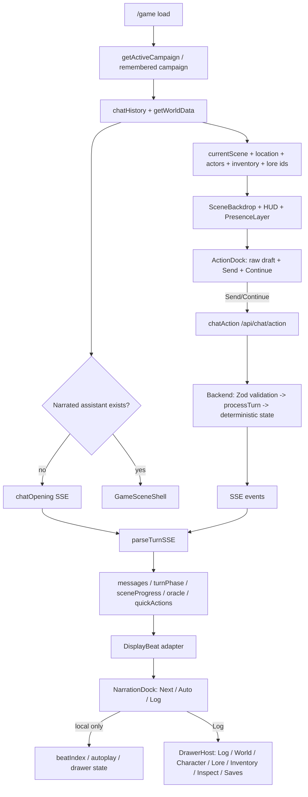

# Phase 77: Scene-First VN/RPG Play Surface and Weekend Playable UX Slice - Research

**Researched:** 2026-05-01
**Domain:** Next.js frontend play-surface refactor over existing authoritative gameplay transport
**Confidence:** HIGH

<user_constraints>
## User Constraints (from CONTEXT.md)

> Source for every constraint in this section: [VERIFIED: .planning/phases/77-scene-first-vn-rpg-play-surface-and-weekend-playable-ux-slic/77-CONTEXT.md]

### Locked Decisions

### Live Play Is A Game Surface

- The default `/game` view must not look like a newspaper, Notion page, SaaS dashboard, or debug cockpit.
- The first five-second read must be "I am in a scene," not "I am reading an admin document."
- The live play layout must use a scene/background layer, compact HUD, visible actor presence, and bottom narration/input dock.

### Marinara Is A Flow Reference, Not A Skin

- Keep Marinara-like presentation functions only when they answer a WorldForge player question.
- Use `Next`, `Auto`, and `Log` cadence to stage text locally.
- Use party/actor presence, map, inventory, journal/log, choice/QTE/dice beats, and scene/text effects as game affordances.
- Do not copy Marinara's exact chrome, spacing, or visual polish.

### Backend Authority Stays Intact

- `Next`, `Auto`, and `Log` are presentation controls and must never create backend turns.
- `Send` and `Continue` create backend turns.
- Presentation effects are display events layered over settled state, not source-of-truth mutations.
- Backend validation/Oracle/tool execution remain deterministic authority.

### Debug Is Optional Inspection

- Oracle math, raw reasoning, JSON, and event payloads must be hidden by default.
- Inspect/debug remains available for audit, but it cannot dominate the normal play surface.
- Player-facing mechanic results should be fiction-facing beats first, raw data second.

### Actor Presence Must Stay Honest

- The UI must distinguish visible/interactable actors from same-area/sensed nearby actors and off-screen anchors.
- Same broad location or persistent sublocation does not imply actors are in arm's reach or visible.
- World/Map drawer can show broader known presence; the scene layer should show only what is present to the player.

### Input Must Support Freeform Play

- Player can act, speak, observe, ask GM/OOC, or simply `Continue`.
- No command syntax should be required.
- Input draft must persist per campaign and survive drawer/open-close navigation.

### Visual Palette Correction

- The Sonnet prototype and Opus prototype's warm paper palette are not the final target.
- Opus is useful for topology/state coverage only.
- Live play should move toward cinematic dark/neutral, rainy/neon, translucent game panels, and a place-first visual read.

### the agent's Discretion

- Exact component names and file split may follow frontend patterns.
- Background art can start as CSS/stylized/generated placeholder if it reads clearly as a place.
- Optional GM/OOC addressing may be explored later as a separate lane. Phase 77 should not add required `Act`, `Speak`, `Observe`, or similar in-fiction action modes.
- Inventory/journal/map can begin as functional drawers reusing current data before richer mechanics land.

### Deferred Ideas (OUT OF SCOPE)

- Full generated-background pipeline.
- Sound system.
- Real QTE engine.
- Full product-wide visual overhaul outside the supporting contracts needed for `/game`.
- Complete inventory economy/mechanics rewrite.
- Complex map visualization.
- Backend presentation-event schema unless a tiny frontend adapter requires a stable local type.
- Detailed provider/settings redesign beyond hiding debug from the play surface.
</user_constraints>

<phase_requirements>
## Phase Requirements

| ID | Description | Research Support |
|----|-------------|------------------|
| P77-R1 | The default `/game` surface presents a scene-first VN/RPG shell instead of a document or permanent multi-column debug cockpit: location/scene visual layer, compact HUD, visible actor presence, bottom narration/input dock, and hidden-by-default debug mechanics. | Replace the current `data-shell-region="game-columns"` tri-column render with a scene-shell composition while reusing the existing data derivation inside `GamePage`. [VERIFIED: .planning/REQUIREMENTS.md] [VERIFIED: frontend/app/game/page.tsx:985-1062] |
| P77-R2 | Latest narration is adapted into local presentation beats with `Next`, `Auto`, and `Log` controls; these controls never create backend turns, while `Send` and first-class `Continue` do. | Add a frontend-only `DisplayBeat` adapter from existing `ChatMessage`, `lastOracleResult`, progress, travel, and quick-action state; route only `Send` and `Continue` through `chatAction`. [VERIFIED: .planning/REQUIREMENTS.md] [VERIFIED: frontend/app/game/page.tsx:652-716] [VERIFIED: frontend/lib/api.ts:1232-1243] |
| P77-R3 | Existing `/game` panels are reorganized into overlays/drawers/widgets for Log, World/Map, Character, Lore/Journal, Inventory, Inspect, and Saves, preserving the input draft and returning to the same scene state. | Move `NarrativeLog`, `LocationPanel`, `CharacterPanel`, `LorePanel`, `OraclePanel`, and `CheckpointPanel` behind a drawer/widget host while keeping their data props sourced from `GamePage`. [VERIFIED: frontend/app/game/page.tsx:993-1066] |
| P77-R4 | Actor presentation distinguishes `visible/interactable now`, `sensed/same-area nearby`, and `off-screen anchors` so a shared broad or persistent location does not imply everyone is in arm's reach. | Reuse `WorldCurrentScene.clearNpcIds`, `sceneNpcIds`, `awareness.byNpcId`, and `hintSignals`; current tests already guard clear NPCs vs hint NPCs. [VERIFIED: frontend/lib/api-types.ts:19-30] [VERIFIED: frontend/app/game/__tests__/page.test.tsx] |
| P77-R5 | The action dock supports freeform play without command syntax, including first-class `Continue`, one raw narrative input, and per-campaign input draft persistence. It must not require `Act`/`Speak`/`Observe` command modes. | Extend `ActionBar` into `ActionDock` with `Continue` and per-campaign storage; keep the backend payload as natural text through `chatAction`. Treat duplicated `intent` as route compatibility only. [VERIFIED: frontend/components/game/action-bar.tsx:7-92] [VERIFIED: backend/src/routes/schemas.ts:188-193] |
| P77-R6 | Oracle/dice/mechanic outcomes are surfaced as fiction-facing game beats by default, with raw chance/roll/reasoning and JSON available only through Inspect/debug affordances. | Convert `OraclePanel` default visibility from inline-open to inspect-only; use `lastOracleResult` as a mechanic beat summary in the bottom dock. [VERIFIED: frontend/components/game/oracle-panel.tsx:35-68] [VERIFIED: frontend/app/game/page.tsx:687-689] |
| P77-R7 | The implementation includes desktop and mobile visual checks proving the default `/game` screenshot reads as a game/VN within five seconds and not as a newspaper/editorial reader/SaaS dashboard. | Add screenshot gates with PinchTab or Browser Use evidence; a repo-level E2E framework is optional for this phase. [VERIFIED: .planning/REQUIREMENTS.md] [VERIFIED: rg --files frontend 2026-05-01] |
| P77-R8 | A live or deterministic 10-turn playtest gate proves the user can continue, act freely, interact with an actor, move or inspect the world, open at least one drawer, and understand consequences without raw debug panels. | Use mocked deterministic `parseTurnSSE` tests for control semantics plus one manual/live playtest checklist. [VERIFIED: frontend/app/game/__tests__/page.test.tsx] [ASSUMED] |
</phase_requirements>

## Summary

Phase 77 should touch the frontend presentation seam first, not the backend engine. `GamePage` already loads the active campaign, restores chat history and `WorldData`, requests an opening scene when no narrated assistant message exists, parses turn SSE events, buffers quick actions until authoritative `done`, and refreshes world state after settled mutations. [VERIFIED: frontend/app/game/page.tsx:315-453] [VERIFIED: frontend/app/game/page.tsx:652-716]

The smallest weekend-playable vertical slice is to keep `GamePage` as the data/turn orchestrator and replace the current permanent tri-column render with `GameSceneShell`, `NarrationDock`, `ActionDock`, `WidgetRail`, and `DrawerHost`. This lets Phase 77 reuse existing world data, chat history, lore search, inventory/equipment, checkpoint, Oracle, quick-action, and travel feedback seams without a backend rewrite. [VERIFIED: frontend/app/game/page.tsx:985-1066] [VERIFIED: frontend/lib/api.ts:993-1016] [VERIFIED: frontend/lib/api.ts:1226-1273]

`DisplayBeat` should be a frontend-only adapter over settled data and stream progress. `Next`, `Auto`, and `Log` mutate only display state; `Send` and `Continue` call existing backend turn transport. This preserves the locked authority boundary while making the latest turn feel like VN/RPG play instead of a scrollback document. [VERIFIED: .planning/phases/77-scene-first-vn-rpg-play-surface-and-weekend-playable-ux-slic/77-CONTEXT.md] [VERIFIED: frontend/lib/api.ts:799-846]

**Primary recommendation:** Extract a scene-first shell around existing `GamePage` state, add a pure `DisplayBeat` adapter plus local cadence controls, then convert current panels into drawers/widgets before any backend or data-model expansion. [VERIFIED: frontend/app/game/page.tsx:234-1075] [VERIFIED: .planning/research/worldforge-design-lab-results.md]

## Architectural Responsibility Map

| Capability | Primary Tier | Secondary Tier | Rationale |
|------------|--------------|----------------|-----------|
| Scene-first visual shell | Browser / Client | CDN / Static | The scene layer, HUD, widget rail, and drawers are render/state concerns inside the Next client page; images can use existing `/api/images` URLs or CSS placeholders. [VERIFIED: frontend/app/game/page.tsx:234] [VERIFIED: frontend/lib/api.ts:1216-1223] |
| `DisplayBeat`, `Next`, `Auto`, `Log` | Browser / Client | - | Beat index, autoplay timer, and log drawer are presentation state and must not create turns. [VERIFIED: 77-CONTEXT.md] |
| `Send` / `Continue` backend turns | API / Backend | Browser / Client | The browser starts the action, but `/api/chat/action` validates `campaignId`, `playerAction`, `intent`, and `method`, then calls `processTurn`. [VERIFIED: backend/src/routes/schemas.ts:188-193] [VERIFIED: backend/src/routes/chat.ts:493-618] |
| Opening scene and restored history | API / Backend | Browser / Client | The frontend calls `chatHistory`, `getWorldData`, and `chatOpening`; the backend owns persisted history and opening generation. [VERIFIED: frontend/app/game/page.tsx:315-389] [VERIFIED: frontend/lib/api.ts:1226-1259] |
| Actor presence bands | API / Backend | Browser / Client | Backend world payload exposes `currentScene`; the frontend must render clear vs hint/off-screen honestly without broad-location overreach. [VERIFIED: frontend/lib/api-types.ts:19-30] [VERIFIED: frontend/app/game/page.tsx:105-143] |
| Lore, map, character, inventory, saves drawers | Browser / Client | API / Backend | Drawers are UI containers; content comes from existing `WorldData`, lore endpoints, and checkpoint endpoints. [VERIFIED: frontend/app/game/page.tsx:493-548] [VERIFIED: frontend/components/game/lore-panel.tsx:20-55] [VERIFIED: frontend/components/game/checkpoint-panel.tsx:37-85] |
| Raw Oracle/reasoning/debug inspect | Browser / Client | API / Backend | The backend streams Oracle/reasoning events; Phase 77 should change disclosure depth, not authority. [VERIFIED: frontend/app/game/page.tsx:687-689] [VERIFIED: frontend/components/game/narrative-log.tsx:222-230] |
| Screenshot and 10-turn gates | Browser / Client | Manual/live environment | Existing automated UI tests are Vitest/jsdom; screenshot/play-feel gates require PinchTab/browser/manual tooling unless a dedicated E2E suite is added later. [VERIFIED: frontend/vitest.config.ts] [VERIFIED: rg --files frontend 2026-05-01] |

## Project Constraints (from CLAUDE.md)

- WorldForge is an AI-driven text RPG sandbox with Node.js/TypeScript backend and Next.js frontend. [VERIFIED: CLAUDE.md]
- Frontend stack is Next.js App Router, Tailwind CSS, and Shadcn UI. [VERIFIED: CLAUDE.md] [VERIFIED: frontend/package.json]
- LLM is narrator only; deterministic engine and backend validation own game state. [VERIFIED: CLAUDE.md]
- SQLite is source of truth and LanceDB is semantic memory. [VERIFIED: CLAUDE.md]
- Zod schemas are required for API payloads and AI tool definitions. [VERIFIED: CLAUDE.md] [VERIFIED: backend/src/routes/schemas.ts:188-193]
- Shared types/constants live in `@worldforge/shared`; do not duplicate shared contracts. [VERIFIED: CLAUDE.md]
- Route handlers use outer try/catch and `parseBody()` validation. [VERIFIED: CLAUDE.md] [VERIFIED: backend/src/routes/chat.ts:493]
- Project-local GitNexus index is up to date at commit `f76bddb`. [VERIFIED: npx gitnexus status 2026-05-01]
- No `.planning/graphs/graph.json` exists, so GSD graphify context is unavailable for this phase. [VERIFIED: Test-Path .planning/graphs/graph.json 2026-05-01]
- `.claude/skills` and `.agents/skills` contain `gitnexus` and `desloppify`; no project `rules` directory was found. [VERIFIED: Get-ChildItem .claude/.agents skills 2026-05-01]

## Standard Stack

### Core

| Library | Version | Purpose | Why Standard |
|---------|---------|---------|--------------|
| Next.js | Locked `16.1.6`; registry current `16.2.4`, modified 2026-05-01 | App Router page runtime for `/game` | Use the existing framework; upgrading Next is not required for Phase 77. [VERIFIED: frontend/package.json] [VERIFIED: frontend/package-lock.json] [VERIFIED: npm registry] |
| React / React DOM | Locked `19.2.3`; registry current `19.2.5`, modified 2026-04-30 | Client component state, effects, rendering | Existing `/game` is a `"use client"` component built with React hooks. [VERIFIED: frontend/package.json] [VERIFIED: frontend/app/game/page.tsx:1-3] [VERIFIED: npm registry] |
| Tailwind CSS | Declared `^4`; frontend lock `4.2.1`; registry current `4.2.4`, modified 2026-05-01 | Utility styling and theme tokens | Existing game UI and global theme use Tailwind classes and custom tokens. [VERIFIED: frontend/package.json] [VERIFIED: frontend/app/globals.css] [VERIFIED: npm registry] |
| Shadcn/Radix primitives | `shadcn` `3.8.5`; `radix-ui` `1.4.3` | Buttons, dialogs, scroll areas, inputs | Existing game panels already use shared UI primitives; drawers/dialogs should reuse them. [VERIFIED: frontend/package.json] [VERIFIED: frontend/components/game/checkpoint-panel.tsx] |
| `@worldforge/shared` | Workspace package | Shared chat message types and lookup parsing | Current `/game` imports `ChatMessage`, `formatLookupLogEntry`, and `isChatMessage` from shared. [VERIFIED: frontend/app/game/page.tsx:22-23] |

### Supporting

| Library | Version | Purpose | When to Use |
|---------|---------|---------|-------------|
| lucide-react | Locked `0.576.0`; registry current `1.14.0`, modified 2026-04-29 | Icons in HUD, widget rail, drawer buttons | Use for tool buttons and affordance icons already present in game components. [VERIFIED: frontend/package.json] [VERIFIED: frontend/app/game/page.tsx:14] [VERIFIED: npm registry] |
| react-markdown + remark-gfm | `react-markdown` `10.1.0`; `remark-gfm` `4.0.1` | Locked safe prose subset in `RichTextMessage` | Reuse for beat text; do not introduce a second markdown parser. [VERIFIED: frontend/package.json] [VERIFIED: frontend/components/game/rich-text-message.tsx] |
| sonner | Locked/current `2.0.7`, modified 2025-08-02 | Toasts for failed init/turn/checkpoint/lore actions | Keep for non-diegetic failure notices, not default game beats. [VERIFIED: frontend/package.json] [VERIFIED: frontend/app/game/page.tsx:4] [VERIFIED: npm registry] |
| Vitest | Locked `3.2.4`; registry current `4.1.5`, modified 2026-04-23 | Component/unit tests | Existing frontend test framework; do not migrate during Phase 77. [VERIFIED: frontend/package.json] [VERIFIED: frontend/vitest.config.ts] [VERIFIED: npm registry] |
| Testing Library React | Locked/current `16.3.2`, modified 2026-01-19 | React DOM interaction tests | Existing component/page tests use it. [VERIFIED: frontend/package.json] [VERIFIED: frontend/app/game/__tests__/page.test.tsx] [VERIFIED: npm registry] |

### Alternatives Considered

| Instead of | Could Use | Tradeoff |
|------------|-----------|----------|
| Local React state for `DisplayBeat` | Backend presentation-event schema | Backend schema is explicitly deferred unless a tiny frontend adapter needs a stable local type. [VERIFIED: 77-CONTEXT.md] |
| Existing Shadcn/Radix dialogs/drawers | New overlay library | A new overlay library adds dependency risk without solving the weekend slice. [VERIFIED: frontend/package.json] [ASSUMED] |
| CSS/stylized scene layer | Full generated-background pipeline | Full generated-background pipeline is deferred; CSS/stylized placeholder is allowed if it reads as place. [VERIFIED: 77-CONTEXT.md] |
| Vitest/jsdom component tests | Immediate dedicated E2E suite | No frontend E2E config was found; screenshot gates can start PinchTab/browser-based unless the planner adds tooling. [VERIFIED: rg --files frontend 2026-05-01] |

**Installation:**

```bash
# No new runtime package is required for the recommended Phase 77 slice.
npm install
```

**Version verification:** `npm view next react lucide-react vitest @testing-library/react tailwindcss sonner version time.modified --json` was run on 2026-05-01. [VERIFIED: npm registry]

## Current Frontend Seams To Touch First

| Order | Seam | First useful change | Why this is first |
|-------|------|---------------------|-------------------|
| 1 | `frontend/app/game/page.tsx` render tree | Keep state and handlers; replace the tri-column JSX with `GameSceneShell` props. | This file owns active campaign, messages, input, turn phase, world data, Oracle result, quick actions, and all backend turn calls. [VERIFIED: frontend/app/game/page.tsx:234-1075] |
| 2 | Derived scene data in `GamePage` | Extract selectors for `currentLocation`, `currentScene`, `connectedPaths`, `npcsHere`, `itemsHere`, and player inventory into a local helper or hook only if tests need it. | The existing derivations already reuse authoritative `WorldData`; frontend should not recompute backend truth. [VERIFIED: frontend/app/game/page.tsx:493-548] |
| 3 | New `DisplayBeat` adapter | Derive local beats from latest assistant text, progress, Oracle result, travel feedback, and quick actions. | It implements `Next`/`Auto`/`Log` without touching backend transport. [VERIFIED: frontend/lib/gameplay-text.ts] [VERIFIED: frontend/app/game/page.tsx:687-716] |
| 4 | `ActionBar` -> `ActionDock` | Add `Continue` and per-campaign draft persistence while preserving raw text submission. | Input is already controlled by `GamePage`; this is the smallest place to add freeform play affordances without inventing action modes. [VERIFIED: frontend/components/game/action-bar.tsx:11-92] |
| 5 | Drawers/widgets | Move current panels into `DrawerHost` and `WidgetRail` one by one. | Current panels are already prop-driven; moving them behind overlays changes disclosure without changing data contracts. [VERIFIED: frontend/components/game/location-panel.tsx] [VERIFIED: frontend/components/game/character-panel.tsx] [VERIFIED: frontend/components/game/lore-panel.tsx] |
| 6 | Visual shell | Add `SceneBackdrop`, `SceneHUD`, and `PresenceLayer` fed by current scene/location/player data. | The visual target requires place-first read; this can start with CSS/stylized background. [VERIFIED: .planning/research/worldforge-visual-target-contract.md] |

## How Existing `/game` State/Data Should Be Reused

| Existing data/state | Current owner | Phase 77 use |
|---------------------|---------------|--------------|
| `activeCampaign` | `GamePage` state | Provides campaign id for all backend calls and per-campaign draft key. [VERIFIED: frontend/app/game/page.tsx:238] |
| `messages` | `GamePage` state from `chatHistory`, opening, action, retry, lookup | Full history remains source for Log drawer; latest assistant message feeds `DisplayBeat`. [VERIFIED: frontend/app/game/page.tsx:239] [VERIFIED: frontend/app/game/page.tsx:315-331] |
| `input` | `GamePage` controlled state | Move into `ActionDock` and persist per campaign; never clear on drawer open/close. [VERIFIED: frontend/app/game/page.tsx:240] [VERIFIED: frontend/components/game/action-bar.tsx:11-19] |
| `turnPhase` / `sceneProgress` | `GamePage` state from SSE handlers | Drives compact HUD/progress and disables duplicate send. [VERIFIED: frontend/app/game/page.tsx:241-242] |
| `lastOracleResult` | `GamePage` state from `onOracleResult` | Show fiction-facing mechanic beat in `NarrationDock`; raw chance/roll/reasoning in Inspect. [VERIFIED: frontend/app/game/page.tsx:245] [VERIFIED: frontend/app/game/page.tsx:687-689] |
| `quickActions` | Buffered until `done` | Render as choice cards only after authoritative turn completion. [VERIFIED: frontend/app/game/page.tsx:302-308] [VERIFIED: frontend/app/game/page.tsx:704-716] |
| `worldData.currentScene` | Parsed from `/api/campaigns/:id/world` | Feed scene title, broad location, clear actors, hint signals, and presence bands. [VERIFIED: frontend/lib/api.ts:397-430] [VERIFIED: frontend/lib/api-types.ts:19-30] |
| `player.inventory` / `player.equipment` | Parsed authoritative world payload | Feed inventory/character drawer; do not derive player inventory from `world.items`. [VERIFIED: frontend/app/game/page.tsx:539-540] [VERIFIED: frontend/app/game/__tests__/page.test.tsx] |
| `travelFeedback` | Derived only from streamed `location_change` state updates | Render as state-change beat; do not infer movement from submitted text. [VERIFIED: frontend/app/game/page.tsx:53-102] [VERIFIED: frontend/app/game/__tests__/page.test.tsx] |
| `LorePanel` cards/search | Existing lore endpoints | Reuse in Journal/Lore drawer. [VERIFIED: frontend/components/game/lore-panel.tsx:20-55] |
| `CheckpointPanel` | Existing checkpoint endpoints | Re-skin/host as Saves drawer; keep backend checkpoint actions. [VERIFIED: frontend/components/game/checkpoint-panel.tsx:37-85] |

## DisplayBeat, Next, Auto, Log

Use a frontend-only adapter named `DisplayBeat` or equivalent. It should be pure and testable, with no fetch calls, no storage writes except local UI state, and no world-state mutation. [VERIFIED: 77-CONTEXT.md]

Recommended local type:

```typescript
type DisplayBeat =
  | { id: string; kind: "narration"; text: string }
  | { id: string; kind: "dialogue"; text: string; speakerName?: string }
  | { id: string; kind: "mechanic"; label: string; text: string; inspectRef?: "oracle" }
  | { id: string; kind: "state"; label: string; text: string }
  | { id: string; kind: "choice"; label: string; action: string };
```

`Next` increments a local `beatIndex`; `Auto` toggles a timer that increments `beatIndex`; `Log` opens a drawer over the same `messages` array. None of those handlers should import or call `chatAction`, `chatOpening`, `chatRetry`, `chatUndo`, `chatEdit`, or `chatLookup`. [VERIFIED: frontend/lib/api.ts:1226-1273]

`Send` should keep the existing action path: `submitAction(input.trim())` calls `chatAction(campaignId, actionText, actionText, "")`. The repeated `actionText` is legacy transport compatibility, not frontend-authored intent. `Continue` should call the same backend action path through an exported `CONTINUE_ACTION_PAYLOAD` constant whose value is `Continue scene.`; the backend schema accepts non-empty `playerAction` and `intent` plus optional `method`. [VERIFIED: frontend/app/game/page.tsx:897-901] [VERIFIED: frontend/app/game/page.tsx:670] [VERIFIED: backend/src/routes/schemas.ts:188-193]

## Architecture Patterns

### System Architecture Diagram



### Recommended Project Structure

```text
frontend/
├── app/game/page.tsx                         # Container: data, backend turn handlers, shell props [VERIFIED: current file]
├── components/game/play-surface/
│   ├── game-scene-shell.tsx                  # Scene-first composition [RECOMMENDED]
│   ├── scene-backdrop.tsx                    # CSS/place visual layer [RECOMMENDED]
│   ├── scene-hud.tsx                         # compact location/turn/save controls [RECOMMENDED]
│   ├── presence-layer.tsx                    # visible/sensed/off-screen actors [RECOMMENDED]
│   ├── stage-overlay.tsx                     # persistent current-beat signals/effects [RECOMMENDED]
│   ├── narration-dock.tsx                    # DisplayBeat rendering + Next/Auto/Log [RECOMMENDED]
│   ├── action-dock.tsx                       # Continue, send, modes, draft persistence [RECOMMENDED]
│   ├── widget-rail.tsx                       # Map/Inventory/Journal/Inspect/Saves buttons [RECOMMENDED]
│   └── drawer-host.tsx                       # overlays containing existing panels [RECOMMENDED]
├── components/game/drawers/
│   ├── log-drawer.tsx                        # full messages history [RECOMMENDED]
│   ├── world-drawer.tsx                      # location graph, sensed/off-screen actors [RECOMMENDED]
│   ├── character-drawer.tsx                  # existing CharacterPanel content [RECOMMENDED]
│   ├── lore-drawer.tsx                       # existing LorePanel content [RECOMMENDED]
│   └── inspect-drawer.tsx                    # Oracle/debug/raw details [RECOMMENDED]
└── lib/display-beats.ts                      # pure adapter + tests [RECOMMENDED]
```

### Pattern 1: Keep `GamePage` As Container

**What:** `GamePage` should continue to own backend calls, SSE parsing, campaign restore, retry/undo/edit, and world refresh. [VERIFIED: frontend/app/game/page.tsx:234-1075]

**When to use:** Use this pattern for Phase 77 because changing backend transport or splitting turn logic at the same time would increase blast radius. [VERIFIED: GitNexus context GamePage 2026-05-01]

**Example:**

```typescript
<GameSceneShell
  campaign={activeCampaign}
  scene={scenePanelData}
  location={currentLocation}
  messages={messages}
  beats={displayBeats}
  beatIndex={beatIndex}
  onNextBeat={advanceBeat}
  onToggleAuto={toggleAuto}
  onOpenDrawer={setOpenDrawer}
  actionValue={input}
  onActionChange={setInput}
  onSend={handleSubmitAction}
  onContinue={() => void submitAction(CONTINUE_ACTION_PAYLOAD)}
/>
```

### Pattern 2: Pure Display Adapter

**What:** Convert latest visible messages and transient UI state into display beats with a pure function. [VERIFIED: frontend/lib/gameplay-text.ts]

**When to use:** Use this for `Next`/`Auto`/`Log` because it is local presentation state and should be unit-testable without a backend. [VERIFIED: 77-CONTEXT.md]

**Example:**

```typescript
export function buildDisplayBeats(input: {
  messages: DisplayChatMessage[];
  oracle: OracleResultData | null;
  travelFeedback: string | null;
  quickActions: QuickAction[];
}): DisplayBeat[] {
  const latestAssistant = [...input.messages].reverse().find((message) => message.role === "assistant");
  const textBeats = latestAssistant
    ? splitGameplayParagraphs(latestAssistant.content).map((text, index) => ({
        id: `latest-${index}`,
        kind: isDialogueParagraph(text) ? "dialogue" : "narration",
        text,
      } as DisplayBeat))
    : [];

  return [
    ...textBeats,
    ...(input.oracle ? [oracleToMechanicBeat(input.oracle)] : []),
    ...(input.travelFeedback ? [{ id: "travel", kind: "state", label: "Travel", text: input.travelFeedback } as DisplayBeat] : []),
    ...input.quickActions.map((action) => ({ id: `choice-${action.label}`, kind: "choice", ...action } as DisplayBeat)),
  ];
}
```

### Pattern 3: Drawer Host Over Existing Panels

**What:** Keep current panel internals, but render them inside overlay/drawer surfaces instead of permanent columns. [VERIFIED: frontend/components/game/location-panel.tsx] [VERIFIED: frontend/components/game/character-panel.tsx] [VERIFIED: frontend/components/game/lore-panel.tsx]

**When to use:** Use this for World/Map, Character, Lore/Journal, Inspect, Log, Inventory, and Saves to satisfy hidden-by-default debug without losing existing feature coverage. [VERIFIED: .planning/research/worldforge-screen-flow-contract.md]

### Pattern 4: Per-Campaign Draft Persistence

**What:** Persist the controlled action draft with a campaign-scoped key. [VERIFIED: frontend/app/game/page.tsx:240] [VERIFIED: frontend/lib/api.ts:91]

**When to use:** Use this for P77-R5 and drawer persistence tests. [VERIFIED: .planning/REQUIREMENTS.md]

**Example:**

```typescript
const draftKey = activeCampaign ? `worldforge:gameDraft:${activeCampaign.id}` : null;
```

### Anti-Patterns to Avoid

- **Backend presentation-event rewrite:** Backend presentation-event schema is explicitly deferred unless a tiny stable local type is required. [VERIFIED: 77-CONTEXT.md]
- **Making `Next`/`Auto` fetch:** `Next`, `Auto`, and `Log` must never create backend turns. [VERIFIED: 77-CONTEXT.md]
- **Broad-location actor chips:** `getAuthoritativeSceneNpcs` correctly prefers clear current-scene NPCs; broad fallback is only for absent `currentScene`. [VERIFIED: frontend/app/game/page.tsx:105-143] [VERIFIED: frontend/app/game/__tests__/page.test.tsx]
- **Permanent raw Oracle panel:** Current `OraclePanel` opens reasoning by default; Phase 77 must move raw details behind Inspect. [VERIFIED: frontend/components/game/oracle-panel.tsx:35-68]
- **Replacing safe markdown rendering:** `RichTextMessage` already uses a restricted allowed-elements subset and skips raw HTML. [VERIFIED: frontend/components/game/rich-text-message.tsx:21-52]
- **Clearing draft on drawer navigation:** P77 requires the draft to persist across drawer open/close. [VERIFIED: .planning/REQUIREMENTS.md]

## Don't Hand-Roll

| Problem | Don't Build | Use Instead | Why |
|---------|-------------|-------------|-----|
| Backend turns | New local turn simulator | Existing `chatAction`, `chatOpening`, `chatRetry`, `chatUndo`, `chatEdit` helpers | Existing transport is campaign-addressed and tested. [VERIFIED: frontend/lib/api.ts:1226-1273] [VERIFIED: frontend/lib/__tests__/api.test.ts:230-354] |
| SSE parsing | New per-component stream parser | Existing `parseTurnSSE` | It already maps `scene-settling`, `narrative`, `reasoning`, `oracle_result`, `state_update`, `quick_actions`, `finalizing_turn`, `done`, and `error`. [VERIFIED: frontend/lib/api.ts:799-846] |
| Actor presence truth | Frontend broad-location inference | Existing `currentScene` awareness and `getAuthoritativeSceneNpcs` | Current tests prove clear NPCs are shown and hint/same-area/off-scene actors are not overexposed. [VERIFIED: frontend/app/game/page.tsx:105-143] [VERIFIED: frontend/app/game/__tests__/page.test.tsx] |
| Lore search | Client-side lore database clone | Existing `getLoreCards` and `searchLore` | Lore drawer can reuse existing API helpers. [VERIFIED: frontend/components/game/lore-panel.tsx:20-55] |
| Inventory authority | Item-owner heuristics | `player.inventory` and `player.equipment` from `WorldData` | Current tests lock authoritative carried/equipped props. [VERIFIED: frontend/app/game/__tests__/page.test.tsx] |
| Markdown/sanitization | Custom markdown parser | `RichTextMessage` with `react-markdown`, `remark-gfm`, `skipHtml`, allowed elements | Existing renderer intentionally limits RP markup. [VERIFIED: frontend/components/game/rich-text-message.tsx:21-52] |
| Icons | Manual SVGs for common tools | `lucide-react` | Project already uses lucide icons in game components. [VERIFIED: frontend/app/game/page.tsx:14] [VERIFIED: frontend/components/game/action-bar.tsx:3] |
| Dialog/checkpoint UI | New modal primitives | Existing Shadcn/Radix `Dialog`, `AlertDialog`, `ScrollArea`, `Button` | Existing panels already use these primitives. [VERIFIED: frontend/components/game/checkpoint-panel.tsx] |

**Key insight:** Phase 77's risk is not data absence; it is disclosure and cadence. The existing runtime already exposes enough state to build a playable shell, so the plan should spend effort on presentation mapping, local UI state, tests, and screenshot/playtest gates. [VERIFIED: frontend/app/game/page.tsx:234-1075] [VERIFIED: .planning/research/worldforge-design-lab-results.md]

## Common Pitfalls

### Pitfall 1: `Next` Or `Auto` Accidentally Creates Turns
**What goes wrong:** A user pressing `Next` or enabling `Auto` calls `chatAction` or advances backend state. [VERIFIED: 77-CONTEXT.md]  
**Why it happens:** The existing `ActionBar` has one submit path, and new controls can be wired through it by mistake. [VERIFIED: frontend/components/game/action-bar.tsx:55-92]  
**How to avoid:** Keep beat controls in `NarrationDock` and assert `chatAction` is not called by `Next`, `Auto`, or `Log`. [RECOMMENDED]  
**Warning signs:** Tests need backend mocks for beat controls. [ASSUMED]

### Pitfall 2: Latest Beat Replaces History
**What goes wrong:** The default surface shows only the latest beat and loses full log, retry/undo/edit context, or lookup history. [VERIFIED: frontend/components/game/narrative-log.tsx:131-267]  
**Why it happens:** A VN dock can hide scrollback without providing a Log drawer. [VERIFIED: .planning/research/worldforge-screen-flow-contract.md]  
**How to avoid:** Keep `messages` unchanged; only adapt the latest assistant output for the dock and render all messages in `LogDrawer`. [RECOMMENDED]  
**Warning signs:** Reloaded lookup/compare tests fail or persisted messages are absent from the Log drawer. [VERIFIED: frontend/app/game/__tests__/page.test.tsx]

### Pitfall 3: Raw Mechanics Stay Emotionally Primary
**What goes wrong:** Oracle chance, roll, and reasoning remain above narration. [VERIFIED: frontend/app/game/page.tsx:1012]  
**Why it happens:** Current `OraclePanel` is inline and starts open. [VERIFIED: frontend/components/game/oracle-panel.tsx:35-68]  
**How to avoid:** Convert Oracle to a compact beat such as `Strong Hit`, `Weak Hit`, or `Miss`; keep raw values in Inspect. [RECOMMENDED]  
**Warning signs:** Default screenshot shows `Chance:` before or beside scene/narration. [VERIFIED: frontend/components/game/oracle-panel.tsx:57]

### Pitfall 4: Presence Honesty Regresses
**What goes wrong:** Same-area NPCs become visible/interactable actor chips. [VERIFIED: .planning/REQUIREMENTS.md]  
**Why it happens:** Broad `currentLocationId` is easier to render than scene awareness bands. [VERIFIED: frontend/app/game/page.tsx:122-143]  
**How to avoid:** Scene layer shows clear actors only; sensed/hint actors and off-screen anchors live in World drawer. [RECOMMENDED]  
**Warning signs:** `Satoru Gojo`/hint-band style fixtures appear in visible actor chips when only clear NPCs should. [VERIFIED: frontend/app/game/__tests__/page.test.tsx]

### Pitfall 5: Draft Loss Across Drawers
**What goes wrong:** The user types an action, opens a drawer, and loses the draft. [VERIFIED: .planning/REQUIREMENTS.md]  
**Why it happens:** Drawer transitions remount the action dock or local state is moved under drawer-specific components. [ASSUMED]  
**How to avoid:** Keep draft state in `GamePage` or a stable `useGameDraft(campaignId)` hook above drawers. [RECOMMENDED]  
**Warning signs:** Drawer tests need to retype after open/close. [ASSUMED]

### Pitfall 6: Visual Shell Still Reads As Admin
**What goes wrong:** The page remains a dense panel surface with prettier colors. [VERIFIED: .planning/research/worldforge-visual-target-contract.md]  
**Why it happens:** Reusing current panels as default columns preserves the existing information hierarchy. [VERIFIED: frontend/app/game/page.tsx:985-1062]  
**How to avoid:** First viewport must show place/background, presence, and bottom dock before debug/lore/mechanics. [VERIFIED: .planning/research/worldforge-visual-target-contract.md]  
**Warning signs:** Desktop screenshot still has permanent left/right sidebars. [VERIFIED: frontend/app/game/page.tsx:993-1062]

## Code Examples

### Local Beat Controls Do Not Fetch

```typescript
function handleNextBeat() {
  setBeatIndex((index) => Math.min(index + 1, beats.length - 1));
}

function handleOpenLog() {
  setOpenDrawer("log");
}
```

Source: recommended implementation pattern over existing `messages` and backend helpers. [RECOMMENDED] [VERIFIED: frontend/lib/api.ts:1226-1273]

### Continue Uses Existing Backend Turn Path

```typescript
function handleContinue() {
  if (isTurnBusy) return;
  void submitAction(CONTINUE_ACTION_PAYLOAD);
}
```

Source: `submitAction` already sends non-empty action text through `chatAction`. [VERIFIED: frontend/app/game/page.tsx:652-716]

### Beat Segmentation Reuses Existing Text Helpers

```typescript
const paragraphs = splitGameplayParagraphs(latestAssistant.content);
const beats = paragraphs.map((paragraph, index) => ({
  id: `latest-${index}`,
  kind: isDialogueParagraph(paragraph) ? "dialogue" : "narration",
  text: paragraph,
}));
```

Source: existing helper exports. [VERIFIED: frontend/lib/gameplay-text.ts]

## State of the Art

| Old Approach | Current Approach | When Changed | Impact |
|--------------|------------------|--------------|--------|
| Equal permanent panels and scrollback log as default `/game` | Scene-first shell with latest-beat dock and drawers | Phase 77 target on 2026-05-01 | Planner should prioritize shell/cadence before richer mechanics. [VERIFIED: .planning/ROADMAP.md] [VERIFIED: .planning/research/worldforge-design-lab-results.md] |
| Raw Oracle panel inline | Fiction-facing mechanic beat with Inspect details | Phase 77 target | Mechanics remain auditable without dominating play. [VERIFIED: 77-CONTEXT.md] |
| Quick actions labeled support/developer-ish | Choice cards after authoritative `done` | Phase 77 target | Choices read as play affordances while preserving rollback boundary. [VERIFIED: frontend/components/game/quick-actions.tsx] [VERIFIED: frontend/app/game/page.tsx:704-716] |
| Full generated backgrounds | CSS/stylized/generated placeholder only if it reads as place | Phase 77 target | Avoids generated-background pipeline scope creep. [VERIFIED: 77-CONTEXT.md] |

**Deprecated/outdated:**
- Default warm paper/editorial live-play palette is rejected for `/game`. [VERIFIED: .planning/research/worldforge-visual-target-contract.md] [VERIFIED: .planning/research/worldforge-design-lab-results.md]
- Permanent debug cockpit layout is not acceptable for Phase 77 default play. [VERIFIED: 77-CONTEXT.md]

## Assumptions Log

| # | Claim | Section | Risk if Wrong |
|---|-------|---------|---------------|
| A1 | The 10-turn gate can combine deterministic Vitest coverage with one manual/live UAT pass rather than requiring a new E2E framework in Wave 0. | Phase Requirements / Validation Architecture | If wrong, planner must add PinchTab automation or another browser automation setup before implementation can pass P77-R8. |
| A2 | A new overlay library is unnecessary because existing Shadcn/Radix primitives are sufficient for the weekend slice. | Standard Stack / Alternatives | If wrong, drawer implementation could spend extra time adapting current dialog primitives. |
| A3 | Drawer remounting is the main draft-loss risk. | Common Pitfalls | If wrong, tests may need to target a different persistence failure mode. |
| A4 | Beat-control warning signs will be easiest to detect through backend-call mocks. | Common Pitfalls | If wrong, tests may need a different instrumentation seam to prove `Next`/`Auto`/`Log` stay local. |
| A5 | The project may choose between adding dedicated E2E tooling now and using PinchTab/Browser Use screenshots for Phase 77 closeout. | Open Questions / Environment Availability | If wrong, the planner may under-spec or over-spec screenshot automation. |
| A6 | The visual slice may choose either one fixed local scene asset or a pure CSS/place layer. | Open Questions | If wrong, planner must lock the asset source before implementation starts. |
| A7 | Codebase-local recommendations should stay valid for about 30 days, while dependency versions need re-checking before dependency changes. | Metadata | If wrong, stale package or architecture assumptions could enter implementation. |

## Open Questions (RESOLVED)

1. **Screenshot gate tooling**
   - What we know: Frontend has Vitest/jsdom tests and no dedicated browser E2E config was found. [VERIFIED: frontend/vitest.config.ts] [VERIFIED: rg --files frontend 2026-05-01]
   - RESOLVED: Phase 77 will use deterministic component/page tests for behavior and a later PinchTab/browser screenshot QA wave for P77-R7. A repo-level E2E project is optional; browser screenshots are enough if they record viewport evidence. `77-06-PLAN.md` owns the desktop/mobile screenshot evidence artifact and agent-run browser verification loop. [VERIFIED: 77-06-PLAN.md]
   - Recommendation: Plan deterministic component tests in early waves and make screenshot/UAT a final verification wave using PinchTab or Browser Use. [RECOMMENDED]

2. **Visual asset source**
   - What we know: Context allows CSS/stylized/generated placeholder if it reads clearly as a place, and defers full generated-background pipeline. [VERIFIED: 77-CONTEXT.md]
   - RESOLVED: Phase 77 will use a CSS/stylized scene layer with location-derived mood and concrete place cues first. It will not add image generation, an asset pipeline, or a fixed art dependency. `77-02-PLAN.md` owns the SceneBackdrop implementation and tests. [VERIFIED: 77-02-PLAN.md]
   - Recommendation: Use a CSS/stylized scene layer with location-derived mood first; do not add image generation or asset pipeline work. [RECOMMENDED]

## Environment Availability

| Dependency | Required By | Available | Version | Fallback |
|------------|-------------|-----------|---------|----------|
| Node.js | Frontend tests/dev | Yes | `v23.11.0` | None needed. [VERIFIED: node --version] |
| npm | Package scripts | Yes | `11.12.1` | None needed. [VERIFIED: npm --version] |
| GitNexus index | Codebase research / pre-commit scope check | Yes | Indexed commit `f76bddb`, up to date | Direct file reads if unavailable. [VERIFIED: npx gitnexus status] |
| Vitest | Component tests | Yes | `3.2.4` | None needed. [VERIFIED: npx --prefix frontend vitest --version] |
| Dedicated browser E2E config | Screenshot automation | No dedicated config | - | Use a PinchTab/browser screenshot gate or add a focused browser automation setup if execution needs repeatable commands. [VERIFIED: rg --files frontend 2026-05-01] |

**Missing dependencies with no fallback:**
- None for implementation. [VERIFIED: Environment audit 2026-05-01]

**Missing dependencies with fallback:**
- Dedicated browser E2E config is absent; use PinchTab screenshots, Browser Use screenshots, or add a focused screenshot setup if execution needs repeatable visual gates. [VERIFIED: rg --files frontend 2026-05-01] [ASSUMED]

## Validation Architecture

### Test Framework

| Property | Value |
|----------|-------|
| Framework | Vitest `3.2.4` with jsdom. [VERIFIED: npx --prefix frontend vitest --version] |
| Config file | `frontend/vitest.config.ts`. [VERIFIED: frontend/vitest.config.ts] |
| Quick run command | `npm --prefix frontend run test -- app/game/__tests__/page.test.tsx components/game/__tests__/action-bar.test.tsx components/game/__tests__/narrative-log.test.tsx components/game/__tests__/location-panel.test.tsx -q` [VERIFIED: frontend/package.json] |
| Full suite command | `npm --prefix frontend run test -- --run` and `npm --prefix frontend run lint`. [VERIFIED: frontend/package.json] |

### Phase Requirements -> Test Map

| Req ID | Behavior | Test Type | Automated Command | File Exists? |
|--------|----------|-----------|-------------------|--------------|
| P77-R1 | `/game` renders scene shell without permanent debug columns | component/page | `npm --prefix frontend run test -- app/game/__tests__/page.test.tsx -q` | Existing file; needs new assertions. [VERIFIED: frontend/app/game/__tests__/page.test.tsx] |
| P77-R2 | `Next`/`Auto`/`Log` local-only; `Send`/`Continue` backend calls | component/unit | `npm --prefix frontend run test -- app/game/__tests__/page.test.tsx components/game/play-surface/__tests__/narration-dock.test.tsx -q` | New `narration-dock` test needed. [RECOMMENDED] |
| P77-R3 | Drawers preserve draft and return to same scene | component/page | `npm --prefix frontend run test -- app/game/__tests__/page.test.tsx -q` | Existing file; add drawer/draft tests. [VERIFIED: frontend/app/game/__tests__/page.test.tsx] |
| P77-R4 | Clear/sensed/off-screen actor bands render distinctly | component/page | `npm --prefix frontend run test -- app/game/__tests__/page.test.tsx components/game/play-surface/__tests__/presence-layer.test.tsx -q` | New `presence-layer` test needed. [RECOMMENDED] |
| P77-R5 | Freeform modes, Continue, draft persistence | component/unit | `npm --prefix frontend run test -- components/game/play-surface/__tests__/action-dock.test.tsx -q` | New file needed. [RECOMMENDED] |
| P77-R6 | Oracle default is fiction-facing; raw detail inspect-only | component/page | `npm --prefix frontend run test -- app/game/__tests__/page.test.tsx components/game/play-surface/__tests__/inspect-drawer.test.tsx -q` | New inspect test needed. [RECOMMENDED] |
| P77-R7 | Desktop/mobile screenshots read as game/VN | manual/browser or E2E | PinchTab/browser screenshot checklist or future dedicated browser command | No automated file exists. [VERIFIED: rg --files frontend 2026-05-01] |
| P77-R8 | 10-turn session gate | manual/live + deterministic mocked SSE | `npm --prefix frontend run test -- app/game/__tests__/page.test.tsx -q` plus UAT checklist | Partial existing mocked SSE coverage. [VERIFIED: frontend/app/game/__tests__/page.test.tsx] |

### Sampling Rate

- **Per task commit:** Run the targeted Vitest file(s) touched by that task. [RECOMMENDED]
- **Per wave merge:** Run `npm --prefix frontend run test -- --run` and `npm --prefix frontend run lint`. [VERIFIED: frontend/package.json]
- **Phase gate:** Full frontend test suite, frontend lint, desktop/mobile screenshot evidence, and 10-turn UAT checklist. [VERIFIED: .planning/REQUIREMENTS.md]

### Wave 0 Gaps

- [ ] `frontend/lib/__tests__/display-beats.test.ts` - covers DisplayBeat segmentation and no-fetch behavior for P77-R2/P77-R6. [RECOMMENDED]
- [ ] `frontend/components/game/play-surface/__tests__/narration-dock.test.tsx` - covers `Next`, `Auto`, `Log`, beat index, and local-only controls. [RECOMMENDED]
- [ ] `frontend/components/game/play-surface/__tests__/action-dock.test.tsx` - covers Continue, modes, draft persistence, disabled busy state. [RECOMMENDED]
- [ ] `frontend/components/game/play-surface/__tests__/drawer-host.test.tsx` - covers drawer open/close preserving draft and scene. [RECOMMENDED]
- [ ] `frontend/components/game/play-surface/__tests__/presence-layer.test.tsx` - covers visible/sensed/off-screen rendering. [RECOMMENDED]
- [ ] Screenshot/UAT evidence artifact - covers P77-R7/P77-R8. [RECOMMENDED]

## Security Domain

### Applicable ASVS Categories

| ASVS Category | Applies | Standard Control |
|---------------|---------|------------------|
| V2 Authentication | No | Local singleplayer product has no auth scope in Phase 77. [VERIFIED: .planning/REQUIREMENTS.md Out of Scope] |
| V3 Session Management | No | Phase uses existing active campaign/remembered campaign, not web auth sessions. [VERIFIED: frontend/app/game/page.tsx:430-454] |
| V4 Access Control | No new scope | Existing campaign id transport remains unchanged. [VERIFIED: frontend/lib/api.ts:1226-1273] |
| V5 Input Validation | Yes | Keep frontend `MAX_ACTION_LENGTH`; backend `chatActionBodySchema` remains final validation for `playerAction`, `intent`, and `method`. [VERIFIED: frontend/components/game/action-bar.tsx:7-38] [VERIFIED: backend/src/routes/schemas.ts:188-193] |
| V6 Cryptography | No | Phase 77 does not add crypto, secrets, or token handling. [VERIFIED: 77-CONTEXT.md Deferred Ideas] |

### Known Threat Patterns for This Stack

| Pattern | STRIDE | Standard Mitigation |
|---------|--------|---------------------|
| XSS through narration/markdown | Tampering | Reuse `RichTextMessage` with `skipHtml` and limited allowed elements. [VERIFIED: frontend/components/game/rich-text-message.tsx:21-52] |
| Raw reasoning/debug disclosure | Information Disclosure | Keep raw reasoning/Oracle JSON behind Inspect/debug toggle; default hidden. [VERIFIED: 77-CONTEXT.md] [VERIFIED: frontend/components/game/narrative-log.tsx:222-230] |
| Duplicate turn submission | Tampering | Preserve `isTurnBusy` disabling for send, continue, quick actions, and movement. [VERIFIED: frontend/app/game/page.tsx:549-552] [VERIFIED: frontend/app/game/page.tsx:897-911] |
| Client-side invented state | Tampering | Treat DisplayBeat and visual effects as local display only; refresh `WorldData` from backend after state updates/done. [VERIFIED: frontend/app/game/page.tsx:691-721] |
| Local draft leakage across campaigns | Information Disclosure | Scope draft storage key by `campaignId` and avoid global input keys. [RECOMMENDED] |

## Sources

### Primary (HIGH confidence)

- `.planning/phases/77-scene-first-vn-rpg-play-surface-and-weekend-playable-ux-slic/77-CONTEXT.md` - locked decisions, discretion, deferred scope. [VERIFIED]
- `.planning/REQUIREMENTS.md` - P77-R1 through P77-R8. [VERIFIED]
- `.planning/ROADMAP.md` - Phase 77 goal/dependency. [VERIFIED]
- `.planning/research/worldforge-screen-flow-contract.md` - screen topology and state preservation. [VERIFIED]
- `.planning/research/worldforge-visual-target-contract.md` - visual target and rejection criteria. [VERIFIED]
- `.planning/research/worldforge-design-lab-results.md` - implementation-slice consensus. [VERIFIED]
- `.planning/research/worldforge-design-agent-brief.md` - design mission and surface checklist. [VERIFIED]
- `.planning/research/marinara-gm-flow-reference.md` - flow reference and adaptation risks. [VERIFIED]
- `frontend/app/game/page.tsx` - current `/game` state, data derivation, turn handling, and layout. [VERIFIED]
- `frontend/components/game/*.tsx` - current panel/action/log/oracle implementations. [VERIFIED]
- `frontend/lib/api.ts` and `frontend/lib/api-types.ts` - world payload parsing and gameplay transport helpers. [VERIFIED]
- `backend/src/routes/schemas.ts` and `backend/src/routes/chat.ts` - backend chat validation and turn route. [VERIFIED]
- GitNexus context/query/status - codebase graph status and `GamePage` context. [VERIFIED: GitNexus MCP / CLI 2026-05-01]

### Secondary (MEDIUM confidence)

- npm registry version lookups for Next, React, Tailwind, lucide-react, Vitest, Testing Library, and sonner. [VERIFIED: npm registry 2026-05-01]

### Tertiary (LOW confidence)

- A1 through A7 assumptions in the Assumptions Log. [ASSUMED]

## Metadata

**Confidence breakdown:**
- Standard stack: HIGH - package files, lockfiles, npm registry, and local tool versions were checked. [VERIFIED: frontend/package.json] [VERIFIED: npm registry]
- Architecture: HIGH - recommendations are based on existing `GamePage` state ownership, source files, tests, and locked design context. [VERIFIED: frontend/app/game/page.tsx] [VERIFIED: 77-CONTEXT.md]
- Pitfalls: HIGH for backend authority/presence/debug risks because they are covered by current source/tests and phase constraints; MEDIUM for screenshot/UAT tooling because browser automation is not present in repo. [VERIFIED: frontend/app/game/__tests__/page.test.tsx] [VERIFIED: rg --files frontend 2026-05-01]

**Research date:** 2026-05-01
**Valid until:** 2026-05-31 for codebase-local recommendations; re-check npm registry before dependency changes. [ASSUMED]
