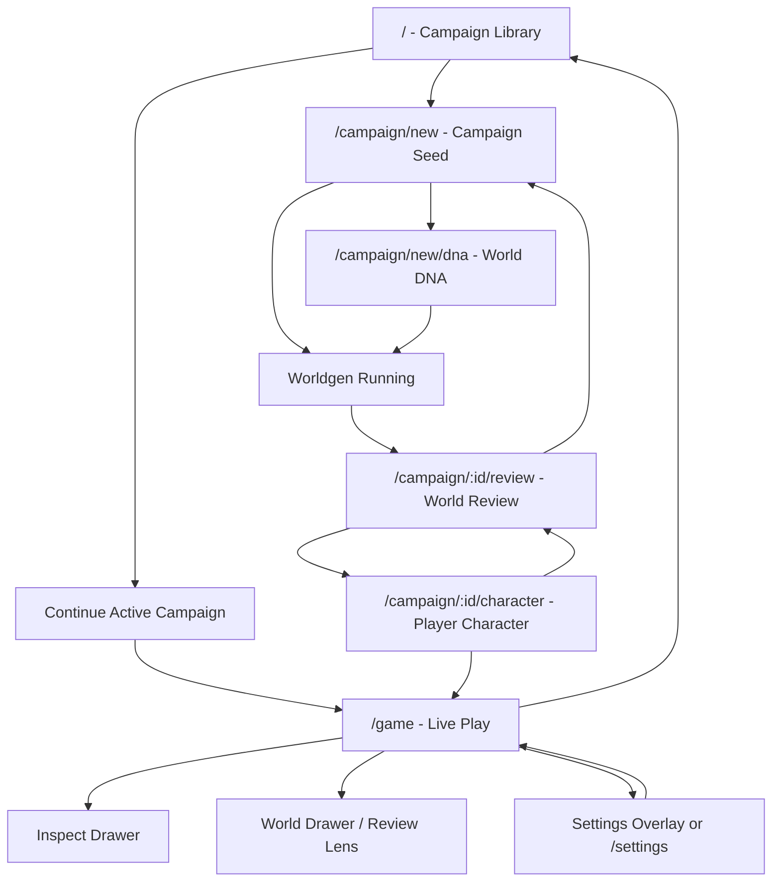

# WorldForge Screen Flow Contract

## Purpose

This document is the UI/navigation contract that must exist before any serious visual design or Open Design agent run. It describes the product topology first: which screens exist, how the player moves between them, which surfaces are pages vs drawers vs modal states, and what state must survive navigation.

Visual prototypes must use this as input. They should not invent the app structure from a single "make it prettier" prompt.

## Product Shape

WorldForge has two different modes that should feel related but not identical:

1. **Campaign setup and review** - a calm authoring/prep workspace where the user builds, imports, reviews, and edits the world before play.
2. **Live play** - a scene-first solo RPG/VN surface where the player reads a current beat, understands who/what is immediately present, acts freely, and can inspect mechanics only when needed.

The live play screen is the product's emotional center. Setup/review exists to make play richer, not to expose database structure for its own sake.

The design system must cover the whole product, not only `/game`. Live play needs a VN/RPG presentation surface; setup/review/settings need their own language:

- campaign launcher/save select
- source/premise authoring
- DNA/constraint shaping
- worldgen progress
- world review/prep
- character import/add/edit cards
- in-play character sheets
- inventory/log/journal/map/widgets
- global settings/model/debug

Patterns can repeat, but they cannot flatten all screens into the same panel layout.

## Current Route Topology

Known current app routes from the frontend:

| Route | Current role | Target product role |
|---|---|---|
| `/` | Campaign list / title entry | Library + quick continue + new campaign entry |
| `/campaign/new` | Concept workspace | Campaign seed / premise / source setup |
| `/campaign/new/dna` | World DNA workspace | Optional world constraints and tone shaping |
| `/campaign/:id/review` | World review | Pre-game world/cast/lore review and repair |
| `/campaign/:id/character` | Character creation/import | Player character authoring and start-state handoff |
| `/game` | Live gameplay shell | Scene-first play surface |
| `/settings` | Provider/roles/gameplay/research settings | Global settings, hidden away from play by default |

## Primary Navigation Graph

## Screen Inventory

### 1. Campaign Library (`/`)

Player question answered: "What can I continue or start?"

Primary elements:
- Continue active campaign.
- Campaign list with last played state, not raw IDs.
- New campaign entry.
- Lightweight settings access.

Persistence:
- Active campaign selection is persistent.
- Deleting/loading campaigns must update active campaign state deliberately.

Should not show:
- Raw world JSON.
- Debug logs.
- Full provider configuration unless user opens settings.

### 2. Campaign Seed (`/campaign/new`)

Player question answered: "What kind of world am I making?"

Primary elements:
- Premise/source text.
- Import/source options: free premise, known IP premise, WorldBook/card reuse.
- Model/research status only as compact progress, not debug stream.
- "Continue to shape world" and "Generate" paths.

Persistence:
- Draft premise, chosen source mode, selected imports, and model choices must survive moving to `/campaign/new/dna` and back.
- Long worldgen progress must survive refresh/reconnect where possible.

### 3. World DNA (`/campaign/new/dna`)

Player question answered: "What constraints/tone should guide world creation?"

Primary elements:
- Tone, genre, danger level, social density, canon/divergence notes.
- Optional, skippable. It should not block quick world creation.

Persistence:
- DNA choices are campaign-creation draft state.
- Back to concept must preserve fields.

### 4. Worldgen Running

Player question answered: "Is the world being built, and what stage is it in?"

Primary elements:
- Stage timeline: research, scaffold, locations, factions, NPCs, lore, save.
- Human-readable progress, not raw heartbeat spam.
- Cancel/retry only where safe.

Persistence:
- Progress stage and final campaign id should survive page change/reload if backend job still exists.
- Partial raw debug may exist, but it belongs behind inspect.

### 5. World Review (`/campaign/:id/review`)

Player question answered: "Does this world make sense before I play?"

Primary elements:
- High-level world summary.
- Location graph with macro/persistent/scene scope visible in human terms.
- Cast grouped by starting presence and off-screen anchor, not one flat list.
- Factions and pressure lines.
- Lore/source cards.
- Targeted regenerate/edit controls.
- "Approve world" / "Continue to character".

Critical behavior:
- Persistent locations can still be large. Being in the same persistent location does not mean actors are visible or interactable.
- Character placement should show "where they start" and "how likely they are to enter the opening scene" separately.

Persistence:
- Edits and regenerated sections must save explicitly and survive route changes.
- Unsaved local edits must warn before leaving or autosave as draft.

Should not show:
- All technical scaffold fields by default.
- Imported/native/canon flags that do not help the LLM/player after game start.

### 6. Character Authoring (`/campaign/:id/character`)

Player question answered: "Who am I, and how do I enter the world?"

Primary elements:
- Character import/generate/manual authoring.
- Identity/personality/power/loadout/start-state review.
- Starting location and visibility/pressure preview.
- Final "Start playing" handoff.

Persistence:
- Character draft, import result, manual edits, preview loadout, and resolved starting location must survive review back/forward.
- Starting conditions become bounded runtime effects, not flavor-only text.

Should not show:
- Duplicate canonical/draft blocks unless user opens advanced inspect.
- Data labels like "imported" if they do not affect play.

### 7. Live Play (`/game`)

Player question answered: "Where am I, what just happened, who/what can I read, and what can I do next?"

Default layout priority:
1. Current scene identity: place, time/mood/weather, turn status.
2. Latest narration as readable beats, not an undifferentiated log wall.
3. Present/clear actors and interactable scene objects.
4. Sensed hints and consequences.
5. Freeform input dock with speech/action/observe/OOC/Continue all supported.
6. Compact choice/quick-action suggestions only after the scene hands control back.

Default live screen must hide:
- Raw Oracle math.
- JSON payloads.
- Full lore database.
- Full character sheets.
- Debug event names like `scene-settling`.

Embedded live states:

| State | Opens from | Closes to | Notes |
|---|---|---|---|
| Reading latest beat | `/game` default | Input handoff | Latest turn can be segmented; full history is secondary. |
| Next/Auto beat playback | Narration box controls | Input handoff / Pause | VN-style cadence; current beat index is display state, not world authority. |
| Input composing | Input dock | Send / Continue / Cancel draft | Draft must not disappear when drawers open. |
| Processing turn | Send / Continue | New latest beat | Show stage/progress compactly; disable unsafe duplicate send. |
| Inspect drawer | Inspect button / hotkey | Previous live state | Mechanics, Oracle, lore, raw events. |
| World drawer | World/Map/Cast button | Previous live state | Travel graph, known actors, local history, discovered lore. |
| Log drawer | Log button | Previous live state | Full session text history; default play surface is not the log. |
| Inventory drawer | Inventory button | Previous live state | Items as usable game objects, not raw data. |
| Journal/records drawer | Journal button | Previous live state | Met/unmet people, clues, notes, GM notes, world records. |
| Character detail overlay | Actor chip / PC chip | Previous live state | Human sheet first, raw record behind advanced. |
| Address mode switch | Input dock selector | Input composing | Scene action, GM note/question, party/direct speech; no command syntax. |
| Choice/QTE prompt | Turn presentation event | Player choice / timeout / dismiss | Temporary pressure beat; backend owns final resolution. |
| Checkpoint/history drawer | History/checkpoint button | Previous live state | Save/load/retry/undo readiness must be explicit. |

Persistence:
- Active campaign and committed turn history are backend-persistent.
- Input draft should persist per campaign at least in session/local storage.
- Drawer open state can be ephemeral, but selected tab may persist locally.
- Latest beat reading progress may be ephemeral; after reload, show latest settled turn and allow "skip to latest".
- Processing turn must survive reconnect as either active progress or restored failure state.

### 8. Inspect Drawer

Player question answered: "Why did that happen, and what does the system know?"

Tabs:
- Oracle: chance band, roll, outcome, short reason; raw details collapsed.
- State: PC status, conditions, location scope, active constraints.
- Lore: relevant facts used this turn, with search.
- Events: canonical events and turn timeline.
- Debug: raw payload/logs, only in debug mode.

Rules:
- Inspect is an overlay/drawer, not a competing permanent column.
- It must never be required to enjoy the scene.
- It must be available when the user wants to audit the system.

### 9. World Drawer / Review Lens

Player question answered: "What do I currently know about the world?"

Surfaces:
- Map/location graph with current macro/persistent/scene scope.
- Local history for current area.
- Known cast, grouped by known location/presence status.
- Factions/pressure.
- Lore cards and notes.

Rules:
- It displays player-known or intentionally inspectable information.
- It should distinguish "same broad area", "nearby scene", "visible now", and "interactable now".

### 10. Settings (`/settings` or Overlay)

Player question answered: "How do I configure providers/gameplay/debug?"

Primary elements:
- Providers/models.
- Role assignments.
- Gameplay options.
- Research settings.
- Debug/developer toggles.

Rules:
- In live play, settings should open as an overlay or preserve return path back to `/game`.
- Provider setup is critical, but it must not visually dominate the player surface.

## State Preservation Rules

| State | Owner | Persistence requirement |
|---|---|---|
| Campaign list/metadata | Backend | Persistent |
| Active campaign id | Backend/frontend setting | Persistent and recoverable after reload |
| Campaign creation draft | Frontend + backend if job started | Survive route changes during setup |
| Worldgen progress | Backend job + frontend poll/SSE | Survive reconnect where possible |
| Generated scaffold/review edits | Backend | Explicit save; unsaved changes protected |
| Character draft/import result | Backend or durable setup draft | Survive review/character navigation |
| Live turn history | Backend | Persistent |
| Active processing turn | Backend/SSE snapshot | Reattach or report restored/failed clearly |
| Input draft | Frontend local/session per campaign | Survive drawer/tab changes and accidental navigation |
| Drawer/tab UI state | Frontend local optional | Nice to persist, not authoritative |
| VN beat index/autoplay | Frontend session/local optional | Restorable convenience; never authoritative |
| Inventory/log/journal open state | Frontend local optional | Nice to persist; content comes from backend |
| Raw debug visibility | Frontend setting | Off by default; sticky if user enables debug mode |

## Player Verbs And UI Homes

| Verb | Primary home | UI behavior |
|---|---|---|
| Continue / let world breathe | `/game` input dock | First-class button next to Send; not treated as invalid empty input |
| Advance text beat | VN narration box | `Next`, `Auto`, `Log`; not a new world turn by itself |
| Speak | `/game` freeform input | Natural language; optional chip only helps framing |
| Act | `/game` freeform input | No command syntax required |
| Observe / inspect scene | `/game` input or hint click | Can resolve as narration + maybe lore reveal |
| Move/travel | `/game` and World drawer | Scene-first affordance, map detail secondary |
| Talk to actor | Actor chip or freeform input | Actor must be visible/interactable, not merely same macro location |
| Address GM/party | Input address selector | Player can write a GM note/question or direct party-facing text without losing main scene context |
| Inspect mechanics | Inspect drawer | Optional audit path |
| Open inventory/log/journal | Floating HUD controls | Game-like drawers/overlays; not default columns |
| Edit world/character pre-play | Review/Character routes | Setup workspace, not live play default |
| Configure model/debug | Settings | Hidden from default play |

## Reality Corrections For Phase 77 Prototype Work

These rules override any older prototype topology when it conflicts with current product behavior.

- Home has one primary resume action. Sidebar `Play`, Home `Continue`, and campaign-card click must not read as three separate buttons for the same hidden route.
- Campaign library should not invent lifecycle filters unless the backend has them. Use real campaign metadata and explicit generation/readiness states.
- Generated campaign review owns NPC import/create before play. There is no current standalone NPC import page.
- Player character creation is a separate post-review flow after the world has been saved.
- World DNA cards must be sized for real DNA text, not short marketing labels.
- Generation progress must represent the current ten-step pipeline after DNA.
- Character/NPC cards must include a drill-in/detail state before implementation planning, because review users need to inspect weaknesses, powers, goals, and placement.
- Live play must keep the last beat and the input draft visible together. `Speak` is not a separate product mode.

## Information Disclosure Ladder

The same fact may exist at multiple disclosure depths:

1. **Diegetic surface** - "The shop upstairs is lit."
2. **Actionable hint** - "A bell rings twice behind the stairwell door."
3. **Mechanic summary** - "Miss: you do not locate the source cleanly."
4. **Mechanic detail** - "Chance 45, roll 90, target unresolved."
5. **Raw debug** - JSON, logs, payloads, model traces.

Default play should live at levels 1-2, occasionally level 3. Levels 4-5 belong in Inspect.

## Design Requirements For Next Prototype

The next Open Design/Opus prompt must include:

- This screen-flow contract.
- A request for the navigation graph to be reflected in the prototype, not only one attractive play screen.
- At least these prototype states: Campaign Library, World Review, Character Handoff, Live Play, Inspect Drawer, World Drawer, Settings Overlay.
- Explicit persistence notes in the UI copy or annotations where relevant.
- A rule that debug/raw panels are visually subordinate and hidden by default.
- A rule that the live play surface distinguishes visible/interactable actors from same-area/off-screen actors.

## Acceptance Tests

1. Five-second live-play read: user can tell where they are, what changed, who is visible, and what they can do.
2. Navigation memory: user can type a draft action, open Inspect and World drawers, return, and the draft remains.
3. Review-to-play continuity: world review placements and player start-state are visible in setup and reflected in opening play.
4. Presence clarity: a character in Shibuya but not in the current alley/shop does not appear as a visible actor.
5. Debug containment: raw Oracle/log/JSON detail is available but not default.
6. Settings return path: opening settings from play returns to the same campaign/play state.
7. Mobile viability: primary play loop works without side-by-side panels.
8. VN cadence: `Next`, `Auto`, and `Log` work without creating new backend turns.
9. Game widgets: inventory/journal/map/party controls feel like game instruments and do not expose raw data by default.
