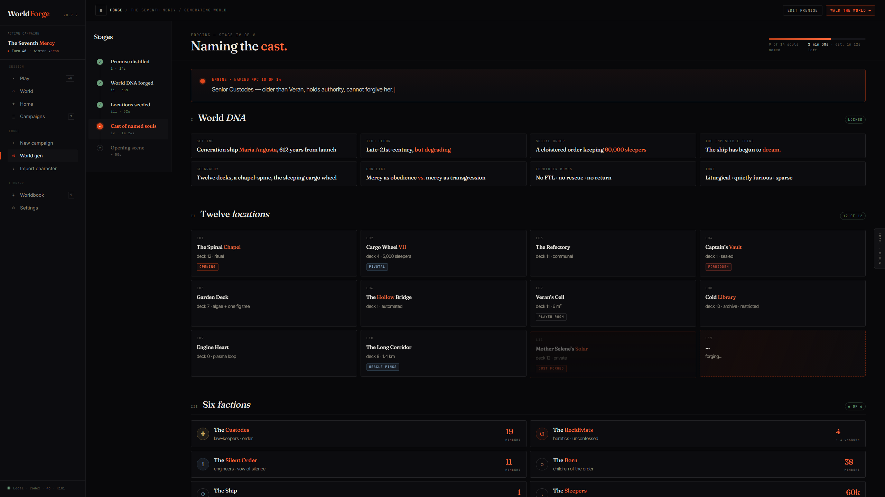
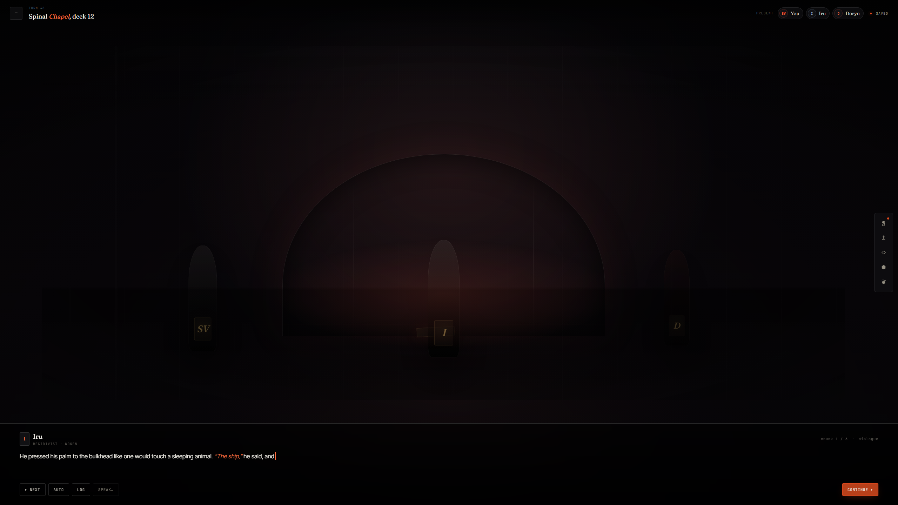
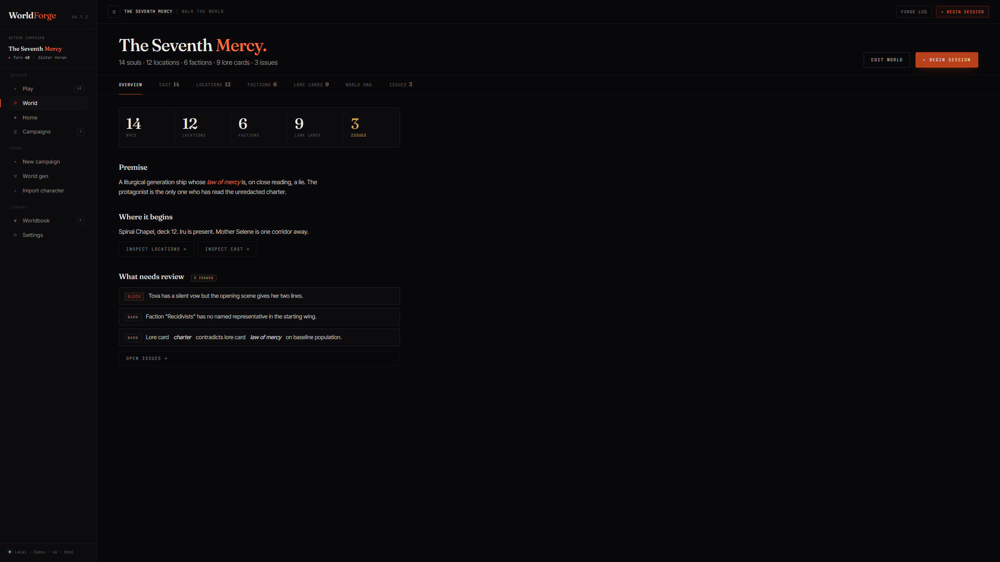

# WorldForge

**A text RPG sandbox where the world keeps playing too.**

WorldForge lets you turn a premise into a playable world: an original setting, a strange crossover, a "what if" version of a story you already know, or something completely yours.

You are not reading a novel about that world. You wake up inside it and start making choices.

You can chase the main disaster, pick a fight with someone stronger than you, become a courier, hide in a hotel, ask awkward questions, or waste an afternoon eating ice cream. The point is that the world is not waiting politely for you to become important. People have goals. Factions have pressure. Rumors spread. Consequences pile up offscreen and eventually reach you.

That is the core fantasy: **a text RPG where the player and the world use the same rules.**


## Why This Exists

Most AI roleplay tools are great at conversation, but the world often behaves like a stage set. NPCs appear when needed, forget what matters, and stop existing when the player leaves the room.

WorldForge is trying to build a different kind of RPG:

- The player is one person inside the world, not the only thing that matters.
- Important NPCs can remember, plan, move, fail, and change things.
- Factions can act through resources, territory, orders, and reports.
- Hidden information stays hidden until the player has a real way to learn it.
- The AI can be creative, but durable changes go through game rules and saved state.

Think of it like a tabletop game with a tireless game master, a living campaign notebook, and a referee that does not let the story accidentally rewrite reality.

## What You Can Do

Start with a sentence:

> Jujutsu Kaisen before Shibuya, but the Naruto chakra system exists too.

Or:

> A generation ship where the captain is dead, the cargo is awake, and mercy has become a law nobody understands anymore.

WorldForge can help turn that into:

- a playable premise;
- world DNA: the few rules that make this world itself;
- locations with relationships and movement logic;
- factions with goals and pressure;
- key NPCs with wants, memory, and private knowledge;
- lore cards and world facts;
- a player character;
- an opening scene you can actually play.



## How It Feels In Play

You type what your character does.

The game master reads it like a human would: intent first, literal words second. If you bluff, it treats that as a bluff. If you claim something false, the world records that you claimed it, not that it became true. If you try to learn a secret, the game checks whether you actually have a path to know it.

Then the game changes the world through tools:

- move a character;
- add an event;
- update a relationship;
- reveal a clue;
- create a rumor;
- wake an NPC or faction process;
- record a memory;
- change a location, item, injury, or threat.

Only after the world has been settled does the narrator write the final prose you see.

That separation matters. The narrator is not allowed to invent permanent facts just because a sentence would sound cooler. It describes the visible result of the turn.



## The Living World Idea

WorldForge does not try to run a full expensive AI brain for every person on every turn. That would be slow, noisy, and wildly expensive.

Instead, it gives the world layers:

- **Key NPCs** are the important people. They can have goals, private knowledge, plans, memories, and moments where they wake up and act.
- **Persistent NPCs** remain real and remembered, but do not need a full independent decision every turn.
- **Temporary NPCs** can exist for a scene, support a location, then fade unless they become important.
- **Factions** act like organized forces: they have resources, reports, doctrine, territories, and operations.
- **World threads** track bigger ongoing changes: investigations, raids, shortages, rituals, disasters, political moves, training arcs.

The target is simple to say and hard to build:

**If you leave the room, the world should still be able to matter.**

## What Makes It Different From A Chatbot

The AI is not just writing the next paragraph.

It is more like this:

1. Understand what the player is trying to do.
2. Look at the visible world state.
3. Decide what should happen and what needs to be checked.
4. Ask the backend to perform concrete game actions.
5. Let the backend save the real state.
6. Give the narrator only the truth the player is allowed to see.
7. Continue from that saved world next turn.

The backend is the part that remembers where people are, what exists, what changed, what is private, and what has been committed. The AI handles meaning, judgment, and improvisation. They are meant to work together instead of pretending one side can do everything.



## Current State

WorldForge is in active development.

The app already has:

- a local campaign app;
- campaign generation with optional source books and worldbooks;
- World DNA cards;
- generated locations, factions, NPCs, lore, placement, and relationships;
- player character creation and character-card import;
- a screen where you can play turns;
- provider settings for OpenAI-compatible and Anthropic-compatible endpoints;
- a dark editorial interface being migrated through the app;
- logic for key NPCs, factions, world threads, narration that does not see hidden facts, and safer saved turns.

This is still an early project, not a polished packaged game. Expect sharp edges. The goal is not a demo that only survives one happy path; the goal is a long-running RPG sandbox that can take strange player choices seriously.

## Quick Start

### Requirements

- Node.js 20+
- npm
- at least one configured LLM provider

### Install

```bash
git clone https://github.com/EidzokuxS/WorldForge.git
cd WorldForge
npm install
```

### Run

```bash
# Backend on :3001 and frontend on :3000
npm run dev
```

Open [http://localhost:3000](http://localhost:3000).

### First Setup

1. Open **Settings -> Providers** and add an OpenAI-compatible or Anthropic-compatible endpoint.
2. Open **Settings -> Roles** and assign models for Judge, Storyteller, Generator, and Embedder.
3. Create a new campaign.
4. Review the generated world.
5. Create or import a player character.
6. Start playing.

## Model Roles, In Plain English

WorldForge uses a few model roles because one prompt should not do every job.

| Role | Plain meaning |
| --- | --- |
| **Judge** | The main game master brain. It understands the turn and decides what game actions are needed. |
| **Storyteller** | The prose writer. It turns already-decided events into readable fiction. |
| **Generator** | The world builder. It makes DNA, locations, factions, lore, and characters. |
| **Embedder** | The search helper. It helps find relevant memories and lore. |

For long games, the Judge model needs enough output and reasoning budget. WorldForge is built around quality turns, not tiny arbitrary response caps.

## Technical Shape

```text
Player action
  -> bounded world frame
  -> AI game master decision
  -> concrete tool checklist
  -> backend state changes
  -> memory / lore / wake signals
  -> visible narration packet
  -> final prose
```

Useful rules:

- A player lie becomes a claim, not a fact.
- Private names and secrets are not safe just because they exist in the database.
- Failed tool actions must not appear in narration as if they happened.
- Background world work cannot silently rewrite a turn that was already returned to the player.

## Data

Campaign data is local:

```text
campaigns/{campaignId}/
  config.json
  chat_history.json
  state.db
  vectors/
  checkpoints/
  logs/
```

- SQLite stores the authoritative world state.
- LanceDB stores semantic vectors for lore and episodic memory.
- JSON files store campaign metadata, role links, generated context, and chat.
- Campaign data is gitignored.

## Development Commands

```bash
# Root
npm run dev                  # backend + frontend
npm run build                # shared + frontend + backend
npm run typecheck            # frontend lint + backend typecheck

# Backend
npm --prefix backend run dev
npm --prefix backend run dev:stable
npm --prefix backend run test
npm --prefix backend run typecheck
npm --prefix backend run structured-output:conformance
npm --prefix backend run db:generate
npm --prefix backend run db:push

# Frontend
npm --prefix frontend run dev
npm --prefix frontend run lint
npm --prefix frontend run typecheck
npm --prefix frontend run visual:v4
```

## Stack

| Area | Tools |
| --- | --- |
| Frontend | Next.js 16, React 19, Tailwind 4, shadcn, Radix UI, lucide-react |
| Backend | Hono, Drizzle ORM, better-sqlite3, Zod, AI SDK, LanceDB, pino |
| Storage | local campaign folders, SQLite, LanceDB vectors |

## Repo Map

```text
WorldForge/
  shared/                  shared types and constants
  frontend/                Next.js app and game UI
  backend/                 API, campaign state, worldgen, GM runtime, tools
  campaigns/               local user data, gitignored
  docs/                    architecture, design, handoff, and research notes
```

## License

AGPL-3.0. See [LICENSE](LICENSE).
