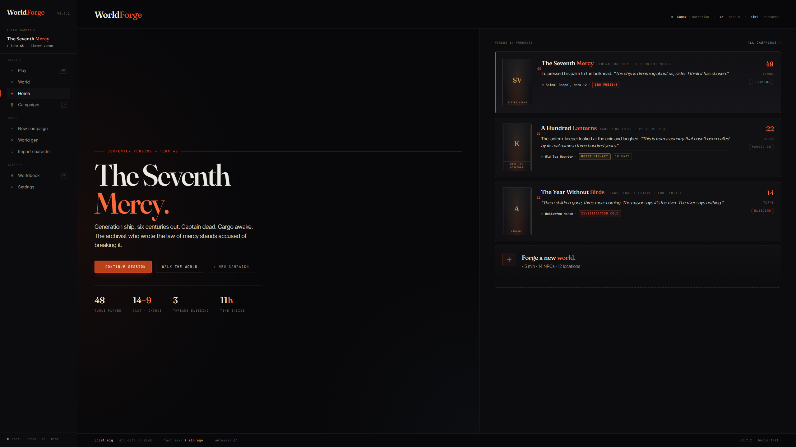

# WorldForge

**Текстовая RPG-песочница, где мир тоже играет.**

WorldForge превращает идею в играбельный мир: оригинальный сеттинг, странный кроссовер, "а что если" по знакомой истории или что-то полностью своё.

Ты не читаешь новеллу про этот мир. Ты просыпаешься внутри него и начинаешь делать выборы.

Можно бежать спасать город, нарываться на персонажа сильнее себя, работать курьером, прятаться в отеле, задавать неудобные вопросы или весь день ходить по туристическим местам и есть мороженое. Смысл в том, что мир не обязан стоять на паузе, пока ты решишь стать главным героем. У людей есть цели. У фракций есть давление. Слухи расходятся. Последствия копятся за кадром и однажды добираются до тебя.

Главная фантазия простая: **текстовая RPG, где игрок и мир живут по одной причинности.**



## Зачем Это Нужно

Многие AI-roleplay инструменты хорошо умеют разговор, но мир часто ощущается как декорация. NPC появляются, когда нужны, забывают важное и перестают существовать, когда игрок выходит из комнаты.

WorldForge пытается построить другой тип RPG:

- игрок — один человек внутри мира, а не единственная важная сущность;
- важные NPC могут помнить, планировать, перемещаться, ошибаться и менять ситуацию;
- фракции могут действовать через ресурсы, территории, приказы и доклады;
- скрытая информация остаётся скрытой, пока у игрока нет честного способа её узнать;
- AI может импровизировать, но прочные изменения мира проходят через правила и сохранённое состояние.

Представь настольную RPG с неустающим гейммастером, живым блокнотом кампании и судьёй, который не даёт красивой фразе случайно переписать реальность.

## Что Можно Сделать

Начать можно с одной фразы:

> Jujutsu Kaisen до Сибуи, но система чакры из Naruto тоже существует.

Или:

> Корабль поколений, капитан мёртв, груз проснулся, а милосердие стало законом, который уже никто не понимает.

WorldForge помогает превратить это в:

- играбельную premise;
- World DNA: несколько правил, которые делают мир именно этим миром;
- локации со связями и логикой перемещения;
- фракции с целями и давлением;
- ключевых NPC с желаниями, памятью и приватным знанием;
- lore-карты и факты мира;
- персонажа игрока;
- стартовую сцену, в которую можно войти и начать играть.


## Как Это Ощущается В Игре

Ты пишешь, что делает персонаж.

Гейммастер читает это по-человечески: сначала намерение, потом буквальные слова. Если ты блефуешь, это блеф. Если ты врёшь, мир запоминает, что ты это сказал, а не превращает ложь в правду. Если ты пытаешься узнать секрет, игра проверяет, есть ли у тебя реальный путь к этому знанию.

Потом игра меняет мир через инструменты:

- переместить персонажа;
- добавить событие;
- обновить отношение;
- раскрыть улику;
- создать слух;
- разбудить NPC или фракционный процесс;
- записать память;
- изменить локацию, предмет, ранение или угрозу.

И только после этого нарратор пишет финальную прозу, которую видишь ты.

Это разделение важно. Нарратор не должен придумывать постоянные факты только потому, что так красивее звучит предложение. Он описывает видимый результат уже решённого хода.


## Идея Живого Мира

WorldForge не пытается запускать дорогой AI-мозг для каждого прохожего на каждом ходу. Это было бы медленно, шумно и дорого.

Вместо этого у мира есть слои:

- **Ключевые NPC** — важные персонажи. У них могут быть цели, приватное знание, планы, память и моменты, когда они просыпаются и действуют.
- **Persistent NPC** остаются реальными и запомненными, но не требуют полного независимого решения каждый ход.
- **Temporary NPC** могут существовать для сцены или локации, а потом исчезнуть, если не стали важными.
- **Фракции** работают как организованные силы: ресурсы, доклады, доктрина, территории и операции.
- **World threads** держат долгие процессы: расследования, рейды, дефициты, ритуалы, катастрофы, политические ходы, тренировки.

Цель легко сказать и трудно сделать:

**если ты вышел из комнаты, мир всё равно должен иметь возможность что-то значить.**

## Чем Это Отличается От Чатбота

AI здесь не просто пишет следующий абзац.

Процесс ближе к такому:

1. Понять, что игрок пытается сделать.
2. Посмотреть на видимое состояние мира.
3. Решить, что должно произойти и что нужно проверить.
4. Попросить backend выполнить конкретные игровые действия.
5. Сохранить реальное состояние мира.
6. Дать нарратору только ту правду, которую игрок может увидеть.
7. Продолжить следующий ход уже из сохранённого мира.

Backend помнит, где кто находится, что существует, что изменилось, что приватно и что уже закоммичено. AI отвечает за смысл, суждение и импровизацию. Они должны работать вместе, а не притворяться, что одна сторона способна сделать всё.


## Текущее Состояние

WorldForge активно разрабатывается.

Уже есть:

- локальное приложение для кампаний;
- генерация кампаний с optional source books и worldbooks;
- World DNA cards;
- сгенерированные locations, factions, NPCs, lore, placement и relationships;
- создание персонажа игрока и импорт character cards;
- экран, где можно играть ходы;
- настройки OpenAI-compatible и Anthropic-compatible провайдеров;
- тёмный editorial-интерфейс, который переносится по приложению;
- логика для key NPC, factions, world threads, наррации без доступа к hidden facts и более безопасных сохранённых ходов.

Это всё ещё ранний проект, а не отполированная packaged game. Острые углы будут. Цель не в демке, которая выдерживает один счастливый путь, а в долгоживущей RPG-песочнице, которая уважает странные решения игрока.

## Быстрый Старт

### Требования

- Node.js 20+
- npm
- хотя бы один настроенный LLM-провайдер

### Установка

```bash
git clone https://github.com/EidzokuxS/WorldForge.git
cd WorldForge
npm install
```

### Запуск

```bash
# Backend на :3001 и frontend на :3000
npm run dev
```

Открыть [http://localhost:3000](http://localhost:3000).

### Первый Запуск

1. Открой **Settings -> Providers** и добавь OpenAI-compatible или Anthropic-compatible endpoint.
2. Открой **Settings -> Roles** и назначь модели для Judge, Storyteller, Generator и Embedder.
3. Создай новую кампанию.
4. Проверь сгенерированный мир.
5. Создай или импортируй персонажа игрока.
6. Начинай играть.

## Модельные Роли Простым Языком

WorldForge использует несколько ролей модели, потому что один промпт не должен делать всю работу сразу.

| Роль | Что значит |
| --- | --- |
| **Judge** | Главный мозг гейммастера. Понимает ход и решает, какие игровые действия нужны. |
| **Storyteller** | Писатель прозы. Превращает уже решённые события в читаемый текст. |
| **Generator** | Строитель мира. Делает DNA, локации, фракции, lore и персонажей. |
| **Embedder** | Помощник поиска. Помогает находить нужные воспоминания и lore. |

Для длинной игры Judge-модели нужен нормальный output и reasoning budget. WorldForge строится вокруг качественных ходов, а не коротких произвольных лимитов ответа.

## Техническая Форма

```text
Действие игрока
  -> ограниченный кадр мира
  -> решение AI-гейммастера
  -> список конкретных tool-действий
  -> изменения состояния на backend
  -> память / lore / wake signals
  -> видимый пакет для нарратора
  -> финальная проза
```

Полезные правила:

- Ложь игрока становится заявлением, а не фактом.
- Приватные имена и секреты не становятся безопасными только потому, что лежат в базе.
- Проваленные tool-действия не должны появляться в наррации как случившиеся.
- Фоновая работа мира не может молча переписать ход, который уже вернули игроку.

## Данные

Данные кампаний лежат локально:

```text
campaigns/{campaignId}/
  config.json
  chat_history.json
  state.db
  vectors/
  checkpoints/
  logs/
```

- SQLite хранит авторитетное состояние мира.
- LanceDB хранит semantic vectors для lore и episodic memory.
- JSON-файлы хранят metadata кампании, ссылки на роли моделей, generated context и chat.
- Campaign data находится в gitignore.

## Команды Разработки

```bash
# Root
npm run dev                  # backend + frontend
npm run build                # shared + frontend + backend
npm run typecheck            # frontend lint + backend typecheck

# Backend
npm --prefix backend run dev
npm --prefix backend run dev:stable
npm --prefix backend run test
npm --prefix backend run typecheck
npm --prefix backend run structured-output:conformance
npm --prefix backend run db:generate
npm --prefix backend run db:push

# Frontend
npm --prefix frontend run dev
npm --prefix frontend run lint
npm --prefix frontend run typecheck
npm --prefix frontend run visual:v4
```

## Стек

| Область | Инструменты |
| --- | --- |
| Frontend | Next.js 16, React 19, Tailwind 4, shadcn, Radix UI, lucide-react |
| Backend | Hono, Drizzle ORM, better-sqlite3, Zod, AI SDK, LanceDB, pino |
| Storage | local campaign folders, SQLite, LanceDB vectors |

## Карта Репозитория

```text
WorldForge/
  shared/                  shared types and constants
  frontend/                Next.js app and game UI
  backend/                 API, campaign state, worldgen, GM runtime, tools
  campaigns/               local user data, gitignored
  docs/                    architecture, design, handoff, research notes
```

## Лицензия

AGPL-3.0. См. [LICENSE](LICENSE).
