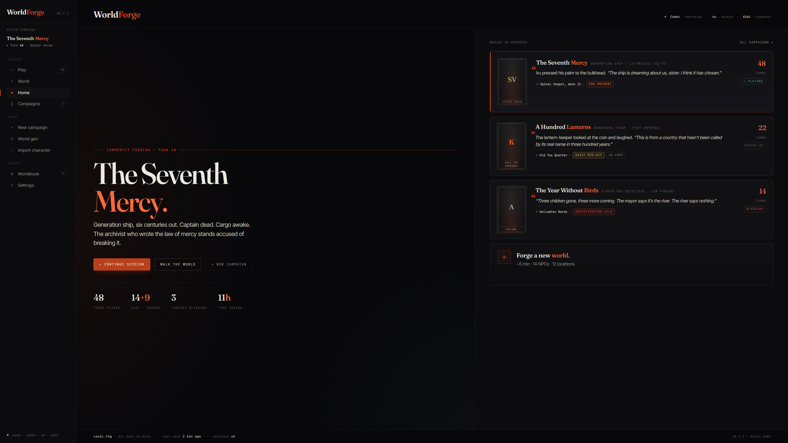
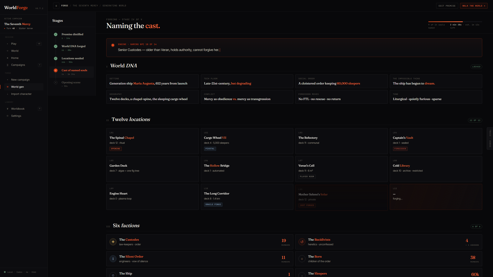
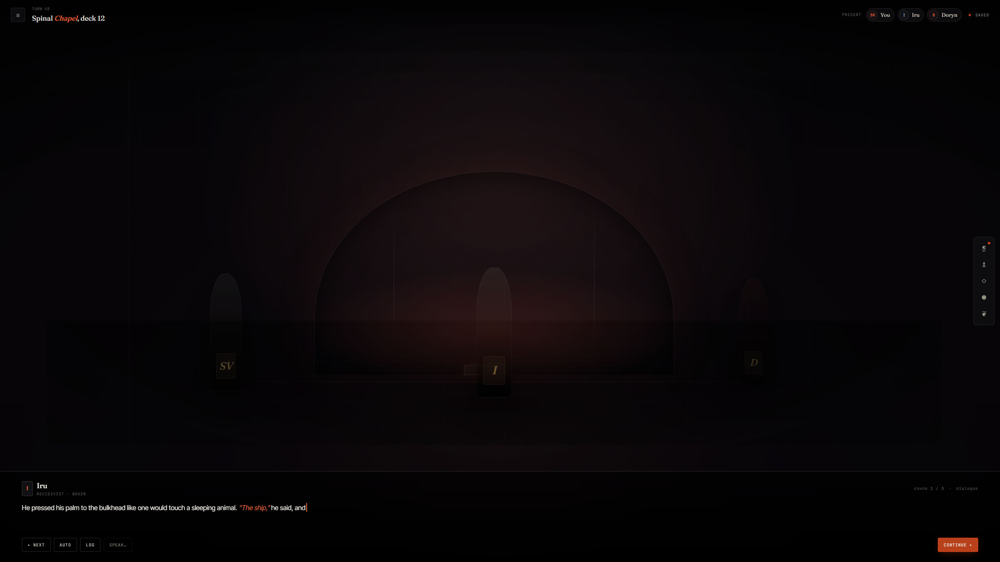
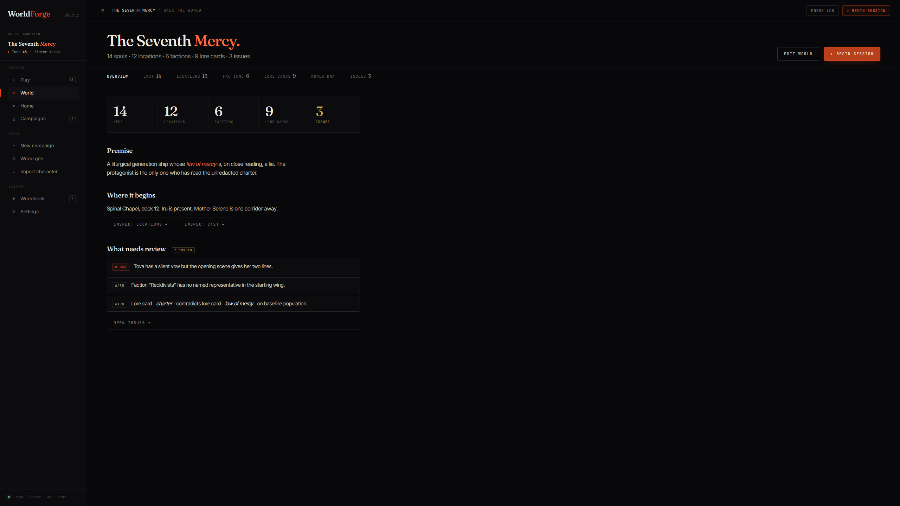

# WorldForge

Текстовая RPG-песочница, где ты создаёшь кампанию, играешь одного персонажа, а мир хранит состояние вокруг тебя.

WorldForge превращает идею в играбельный мир: оригинальный сеттинг, странный кроссовер, "а что если" по знакомой истории или что-то полностью своё.

Ты просыпаешься внутри этого мира и начинаешь делать выборы.

Можно бежать спасать город, нарываться на персонажа сильнее себя, работать курьером, прятаться в отеле, задавать неудобные вопросы или весь день ходить по туристическим местам и есть мороженое. Смысл в том, что мир не обязан стоять на паузе, пока ты решишь стать главным героем. У людей есть цели. У фракций есть давление. Слухи расходятся. Последствия копятся за кадром и однажды добираются до тебя.

Главная фантазия простая: текстовая RPG, где игрок и мир живут по одной причинности.



## Зачем это нужно

Многие AI-roleplay инструменты хорошо умеют разговор, но мир часто ощущается как декорация. NPC появляются, когда нужны, забывают важное и перестают существовать, когда игрок выходит из комнаты.

WorldForge строит другой тип RPG:

- игрок находится внутри мира как один человек;
- важные NPC могут помнить, планировать, перемещаться, ошибаться и менять ситуацию;
- фракции могут действовать через ресурсы, территории, приказы и доклады;
- скрытая информация остаётся скрытой, пока у игрока нет честного способа её узнать;
- AI может импровизировать, но прочные изменения мира проходят через правила и сохранённое состояние.

Игра должна импровизировать как настольный гейммастер и вести записи как блокнот кампании. Красивая фраза может улучшить сцену, оставаясь внутри сохранённой реальности.

## Что можно сделать

Начать можно с одной фразы:

> Jujutsu Kaisen до Сибуи, но система чакры из Naruto тоже существует.

Или:

> Корабль поколений, капитан мёртв, груз проснулся, а милосердие стало законом, который уже никто не понимает.

WorldForge помогает превратить это в:

- играбельную premise;
- World DNA: несколько правил, которые делают мир именно этим миром;
- локации со связями и логикой перемещения;
- фракции с целями и давлением;
- ключевых NPC с желаниями, памятью и приватным знанием;
- lore-карты и факты мира;
- персонажа игрока;
- стартовую сцену, в которую можно войти и начать играть.



## Как это ощущается в игре

Ты пишешь, что делает персонаж.

Гейммастер читает это по-человечески: сначала намерение, потом буквальные слова. Если ты блефуешь, это блеф. Если ты врёшь, мир запоминает, что ты это сказал, а не превращает ложь в правду. Если ты пытаешься узнать секрет, игра проверяет, есть ли у тебя реальный путь к этому знанию.

Потом игра меняет мир через runtime-действия:

- переместить персонажа;
- добавить событие;
- обновить отношение;
- раскрыть улику;
- создать слух;
- разбудить NPC или фракционный процесс;
- записать память;
- изменить локацию, предмет, ранение или угрозу.

И только после этого нарратор пишет финальную прозу, которую видишь ты.

Это разделение важно. Жёсткие факты принадлежат receipts: перемещение, доступные маршруты, инвентарь, ранения, точные реплики, секреты, отношения и изменения мира требуют принятого доказательства. Нарратор может использовать мягкий prose budget для безопасной видимой фактуры, например звука, цвета, износа или обычной поверхности. Такая деталь делает текст живее. Будущий ход всё равно должен подтвердить её, прежде чем игра начнёт считать её сохранённым фактом мира.



## Идея живого мира

WorldForge распределяет внимание слоями вместо дорогого AI-мозга для каждого прохожего на каждом ходу. Полная симуляция была бы медленной, шумной и дорогой.

Вместо этого у мира есть слои:

- Ключевые NPC это важные персонажи. У них могут быть цели, приватное знание, планы, память и моменты, когда они просыпаются и действуют.
- Persistent NPC остаются реальными и запомненными, но не требуют полного независимого решения каждый ход.
- Temporary NPC могут существовать для сцены или локации, а потом исчезнуть, если не стали важными.
- Фракции работают как организованные силы: ресурсы, доклады, доктрина, территории и операции.
- World threads держат долгие процессы: расследования, рейды, дефициты, ритуалы, катастрофы, политические ходы и тренировки.

Цель легко сказать и трудно сделать:

если ты вышел из комнаты, мир всё равно должен иметь возможность что-то значить.

## Чем это отличается от чатбота

AI здесь делает больше, чем пишет следующий абзац.

Активный игровой путь работает так:

1. Понять, что игрок пытается сделать.
2. Посмотреть на видимое состояние мира.
3. Решить, что должно произойти и что нужно проверить.
4. Попросить backend выполнить конкретные runtime-действия.
5. Сохранить реальное состояние мира через receipts.
6. Дать нарратору только ту правду, которую игрок может увидеть.
7. Закоммитить player-facing turn record.
8. Продолжить следующий ход уже из сохранённого мира.

Backend помнит, где кто находится, что существует, что изменилось, что приватно и что уже закоммичено. AI отвечает за смысл, суждение и прозу. Они работают вместе, а не притворяются, что одна сторона способна сделать всё.



## Текущее состояние

WorldForge активно разрабатывается.

Уже есть:

- локальное приложение для кампаний;
- генерация кампаний с optional source books и worldbooks;
- World DNA cards;
- сгенерированные locations, factions, NPCs, lore, placement и relationships;
- создание персонажа игрока и импорт character cards;
- экран, где можно играть ходы;
- настройки OpenAI-compatible и Anthropic-compatible провайдеров;
- тёмный editorial-интерфейс, который переносится по приложению;
- логика для key NPC, factions, world threads, narrator-visible packets, receipt-backed hard facts и более безопасных сохранённых ходов;
- clean gameplay runtime на `/chat/action`.

Активная игра использует `gameplay-cycle-runtime`. Старые V1/V2 gameplay runtime пути архивированы или убраны из активного дерева. Обычная игра не требует env flags выбора runtime.

Это всё ещё ранний проект с острыми углами. Цель в долгоживущей RPG-песочнице, которая уважает странные решения игрока.

## Быстрый старт

### Требования

- Node.js 20+
- npm
- хотя бы один настроенный LLM-провайдер

### Установка

```bash
git clone https://github.com/EidzokuxS/WorldForge.git
cd WorldForge
npm install
```

### Запуск

```bash
# Backend на :3001 и frontend на :3000
npm run dev
```

Открыть [http://localhost:3000](http://localhost:3000).

### Первый запуск

1. Открой Settings -> Providers и добавь OpenAI-compatible или Anthropic-compatible endpoint.
2. Открой Settings -> Roles и назначь модели для Judge, Storyteller, Generator и Embedder.
3. Создай новую кампанию.
4. Проверь сгенерированный мир.
5. Создай или импортируй персонажа игрока.
6. Начинай играть.

Для gameplay не нужны env flags. Когда провайдеры и роли настроены, `/chat/action` по умолчанию использует clean runtime.

## Модельные роли

WorldForge использует несколько ролей модели, потому что разным задачам нужны разные промпты.

| Роль | Что значит |
| --- | --- |
| Judge | Главный мозг гейммастера. Понимает ход и решает, какие игровые действия нужны. |
| Storyteller | Писатель прозы. Превращает уже решённые события в читаемый текст. |
| Generator | Строитель мира. Делает DNA, локации, фракции, lore и персонажей. |
| Embedder | Помощник поиска. Помогает находить нужные воспоминания и lore. |

Для длинной игры Judge-модели нужен нормальный output и reasoning budget. WorldForge строится вокруг качественных ходов, а не коротких произвольных лимитов ответа.

## Техническая форма

```text
Действие игрока
  -> ограниченный кадр мира
  -> clean GM read
  -> uncertainty / oracle check при необходимости
  -> список конкретных runtime-действий
  -> receipt-backed изменения состояния на backend
  -> settled turn packet
  -> narrator view
  -> финальная проза
  -> player-facing turn record
```

Полезные правила:

- Ложь игрока становится заявлением.
- Приватные имена и секреты требуют player-visible authority перед раскрытием.
- Проваленные tool-действия остаются вне наррации.
- Мягкая проза может описывать безопасную видимую фактуру. Receipts создают жёсткие факты.
- Фоновая работа мира сохраняет уже возвращённые ходы.

## Данные

Данные кампаний лежат локально:

```text
campaigns/{campaignId}/
  config.json
  chat_history.json
  state.db
  vectors/
  checkpoints/
  logs/
```

- SQLite хранит авторитетное состояние мира.
- LanceDB хранит semantic vectors для lore и episodic memory.
- JSON-файлы хранят metadata кампании, ссылки на роли моделей, generated context и chat.
- Campaign data находится в gitignore.

## Команды разработки

```bash
# Root
npm run dev                  # backend + frontend
npm run build                # shared + frontend + backend
npm run typecheck            # frontend lint + frontend TypeScript (including tests) + backend typecheck

# Backend
npm --prefix backend run dev
npm --prefix backend run dev:stable
npm --prefix backend run test
npm --prefix backend run typecheck
npm --prefix backend run structured-output:conformance
npm --prefix backend run db:generate
npm --prefix backend run db:push

# Frontend
npm --prefix frontend run dev
npm --prefix frontend run lint
npm --prefix frontend run typecheck
npm --prefix frontend run visual:v4
```

## Стек

| Область | Инструменты |
| --- | --- |
| Frontend | Next.js 16, React 19, Tailwind 4, shadcn, Radix UI, lucide-react |
| Backend | Hono, Drizzle ORM, better-sqlite3, Zod, AI SDK, LanceDB, pino |
| Storage | local campaign folders, SQLite, LanceDB vectors |

## Карта репозитория

```text
WorldForge/
  shared/                  shared types and constants
  frontend/                Next.js app and game UI
  backend/                 API, campaign state, worldgen, GM runtime, tools
  campaigns/               local user data, gitignored
  docs/                    active mechanics, memory, research, playtest, and README assets
```

## Лицензия

AGPL-3.0. См. [LICENSE](LICENSE).
